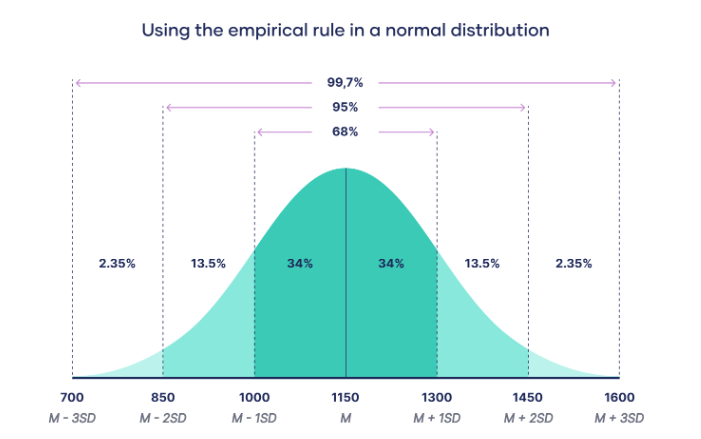

A distribution in simple terms refers to how values are spread out across a dataset. 
While central tendency focuses on summarizing the data with a single value (like the mean), and dispersion looks at how spread out the data is, distribution analysis delves into the shape and characteristics of the entire dataset.
This helps us understand the underlying patterns and relationships within the data, by helping answer questions like 

**"Are our delivery times meeting customer expectations across different regions?"**

### 🧠 Why Distribution Analysis?

You don’t just want the **average** delivery time. You want to know:

- How **spread out** the delivery times are (consistency)
- If some regions experience **frequent delays** (skewed distribution)
- Whether there are **outliers** (e.g., lost or delayed shipments)
- Whether the data is **normal** (bell-shaped) or skewed (long tail on one side)
- If there’s **more than one peak** (e.g., fast vs slow carriers)

### 📊 How Distribution Analysis Helps

| **What You Learn**            | **What It Tells You in Business Terms**                                           |
|-------------------------------|------------------------------------------------------------------------------------|
| **Shape** (e.g., skewed?)     | Are some customers consistently getting delayed deliveries?                       |
| **Spread** (std dev, IQR)     | Are our delivery times consistent or highly variable?                             |
| **Outliers**                  | Are a few extreme delays dragging down customer experience?                       |
| **Comparing regions**         | Do some cities or countries have much worse delivery reliability than others?     |
| **Peaks (modes)**             | Are there different “clusters” — like standard vs express shipping?               |

### 🛠️ What actions will the analysis drive?
- Flag regions with **long right tails** in their delivery time distribution (chronic delays).
- Optimize logistics where **variance** is too high.
- Adjust customer expectations based on **actual distributions**, not just averages.

--- 

## Central Limit Theorem (CLT) 📏

The Central Limit Theorem (CLT) states that the distribution of sample means will tend to be normal, regardless of the shape of the population distribution, as long as the sample size is sufficiently large (usually n > 30).

### Normal Distribution 📈

Normal distribution is a very popular and widely used probability distribution in statistics. It is often referred to as the Gaussian distribution, named after Carl Friedrich Gauss, who first described it. The normal distribution is important because many statistical methods and tests are based on the assumption that the data follows a normal distribution.

Practically it is so important because many natural phenomena tend to follow a normal distribution, such as heights, weights, test scores, and measurement errors. 

In business, understanding the normal distribution can help in quality control, risk assessment, and decision-making processes.No matter the shape of your original data, the distribution of sample means will tend toward a normal distribution as the sample size grows.

The normal distribution is a continuous probability distribution characterized by its bell-shaped curve. It is defined by two parameters: the mean (μ) and the standard deviation (σ). Many natural phenomena tend to follow a normal distribution, making it a crucial concept in statistics.

#### Key Characteristics

- **Symmetry**: The normal distribution is symmetric around the mean.
- **Bell-shaped Curve**: Forms a bell-shaped curve, with the highest point at the mean, median, and mode.
- **68-95-99.7 Rule**: 
  - ~68% of data within ±1σ of the mean
  - ~95% within ±2σ
  - ~99.7% within ±3σ

### How CLT and normal distribution help us in day to day reporting and decision making?
📊 Example: Estimating Average Time spent by customers on a website
- You sample 50 users from your website to see how long they spend on a page.
- Their average is 4.3 minutes, and the standard deviation is 1.2 minutes.
- Thanks to the CLT, you can assume the sample mean follows a **normal distribution**.
- You construct a 95% confidence interval using this information — and you can confidently say:
💬 **"We estimate the average time users spend on this page is between 4.0 and 4.6 minutes."**

But, real data is not perfect and it is important to understand the shape of the data.
And the following is how a Data Analyst would approach this:

| **Stage**                        | **Concept**                              | **Why It Matters**                                                                 |
|----------------------------------|------------------------------------------|-------------------------------------------------------------------------------------|
| ✅ Start Here                     | CLT & Normal Distribution                | Use for confidence intervals, z-tests, A/B testing assumptions                     |
| 🔍 Notice a Problem              | Histograms aren't symmetric (plot is not same as expected normal distribution)             | Not all data follows a bell curve — something’s off                               |
| ↩️ Check Skewness                | Measures asymmetry (left/right lean)     | Explains why your mean ≠ median                                                   |
| ⛰️ Check Kurtosis                | Measures peakedness & tail heaviness     | Shows whether outliers are common or rare. Helps spot data with extreme values more often than expected.             |

---
### Skewness and Kurtosis 📏
| **Measure**       | **Formula**           | **Intuition / Meaning**                                               | **When to Use**                                 | **Business Question It Solves**                                 |
|-------------------|------------------------|------------------------------------------------------------------------|--------------------------------------------------|-----------------------------------------------------------------|
| **Skewness**      | (Σ(x − μ)³ / n) / σ³  | Measures asymmetry of distribution — positive or negative skew        | Understanding data shape and outliers           | Are customer ratings generally positive or negative?            |
| **Kurtosis**      | (Σ(x − μ)⁴ / n) / σ⁴  | Measures “tailedness” — high kurtosis indicates more extreme values   | Identifying outliers and extreme values         | Are there any extreme customer ratings?                         |

  
   

### 🧠 Quick Comparison Table: Skewness vs Kurtosis (With a Twist)

| **Term**       | **What It’s Really Saying**                     | **What to Watch For**                    |
|----------------|--------------------------------------------------|------------------------------------------|
| **Skewness**   | “My average is lying to you.”                    | Use **median** if the **mean is misleading**. |
| **Kurtosis**   | “I swear I’m mostly normal... except for THESE wild values you should definitely pay attention to!" | Beware of **outliers** that can distort your analysis. |

### Shapiro-Wilk Test for Normality 🔍

The Shapiro-Wilk test is a statistical test that assesses whether a given dataset is normally distributed. It generates a W statistic that compares the observed distribution of data to a normal distribution. A small p-value (typically less than 0.05) indicates that the null hypothesis of normality can be rejected, suggesting that the data do not follow a normal distribution.
