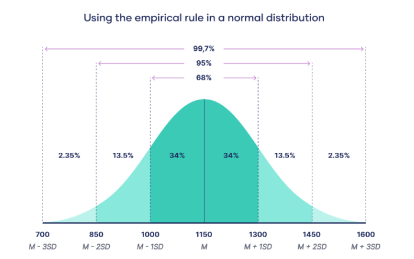
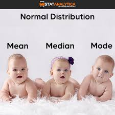
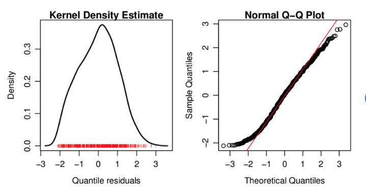

In this module, we will explore various statistical distributions that help us understand the underlying patterns in our data. Key topics include:

### 1. Normal Distribution 📈

The normal distribution is a continuous probability distribution characterized by its bell-shaped curve. It is defined by two parameters: the mean (μ) and the standard deviation (σ). Many natural phenomena tend to follow a normal distribution, making it a crucial concept in statistics.

### Key Characteristics

- **Symmetry**: The normal distribution is symmetric around the mean.
- **Bell-shaped Curve**: Forms a bell-shaped curve, with the highest point at the mean, median, and mode.
- **68-95-99.7 Rule**: 
  - ~68% of data within ±1σ of the mean
  - ~95% within ±2σ
  - ~99.7% within ±3σ

In a normal distribution, the mean, median, and mode are all equal, making it unique compared to skewed distributions.

### KDE Plot
A KDE (Kernel Density Estimation) plot is a powerful tool for visualizing the distribution of a dataset.

### Q-Q Plot 📊
A Quantile-Quantile (Q-Q) plot is a graphical tool used to compare the distribution of a dataset against a theoretical distribution, such as the normal distribution. If the points in the Q-Q plot lie approximately along a straight line, it suggests that the data follows the specified distribution.

### Q-Q Plot vs. KDE Plot

A Q-Q (Quantile-Quantile) plot serves a different purpose than a KDE (Kernel Density Estimation) plot. Here are the main distinctions:

1. **Purpose**:
   - **KDE**: Estimates and visualizes the probability density function of a dataset.
   - **Q-Q Plot**: Compares the distribution of a sample dataset to a theoretical distribution (typically the normal distribution).

2. **Visualization**:
   - **KDE**: Displays a continuous curve representing the estimated density of data points.
   - **Q-Q Plot**: Plots the quantiles of the sample data against the quantiles of the theoretical distribution.

3. **Axes**:
   - **KDE**: The X-axis represents variable values, while the Y-axis shows density.
   - **Q-Q Plot**: Both axes represent quantiles, with one axis for theoretical quantiles and the other for sample quantiles.

4. **Interpretation**:
   - **KDE**: Helps to visualize the shape, peaks, and spread of the data distribution.
   - **Q-Q Plot**: Assesses whether a dataset follows a specific theoretical distribution. A straight line indicates a good fit.

5. **Normality Assessment**:
   - **KDE**: Can suggest normality if the shape appears bell-like, but this is not definitive.
   - **Q-Q Plot**: Specifically designed to evaluate normality or other theoretical distributions.

6. **Multiple Distributions**:
   - **KDE**: Can easily compare several distributions on the same plot.
   - **Q-Q Plot**: Typically compares one sample distribution to one theoretical distribution.

7. **Outlier Detection**:
   - **KDE**: Outliers may be visible as small bumps in the tails but can sometimes be obscured.
   - **Q-Q Plot**: Outliers are generally evident as points deviating from the straight line.

### Poisson Distribution 📬

The Poisson distribution is a discrete probability distribution that expresses the probability of a given number of events occurring in a fixed interval of time or space, given that these events happen with a known constant mean rate and are independent of the time since the last event. This distribution is often used for modeling counts, such as the number of transactions per day.

### Shapiro-Wilk Test for Normality 🔍

The Shapiro-Wilk test is a statistical test that assesses whether a given dataset is normally distributed. It generates a W statistic that compares the observed distribution of data to a normal distribution. A small p-value (typically less than 0.05) indicates that the null hypothesis of normality can be rejected, suggesting that the data do not follow a normal distribution.
