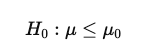
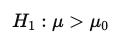

### Hypothesis-Testing

In our previous chapter, we learned about statistical concepts and Exploratory Data Analysis.
These helped us to understand the data, its distribution, relationship between different variables 
and have a better understanding of the sample data.

In this chapter, we will learn about Hypothesis Testing, and how to test the hypothesis using statistical methods.

### What is Hypothesis and Hypothesis Testing?
Let's Discuss this with a business example. Suppose we are building an e-commerce website implementing search and filter functionalities.
We need to have two filters, for ease of narrowing down the search results.
1. Filter by Brand 
2. Filter by Price Range

There are two ways to implement this functionality,
1. For a mobile phone purchase, the user selects the filters, `Apple` as the Brand and `< $1000` as `Price Range`

    Expectation: The website should show only the products which are `Apple` Brand and also `Price Range` is `< $1000` (Logical AND)

2. In another scenario, `Apple` is the Brand, and `< $1000` is `Price Range`
    Expectation: The website should show all the mobile phones of `Apple` Brands including prices greater than `$1000`
    and also All the phones which are less than the `Price Range < $1000` irrespective of the Brand (Logical OR)

Now the Product Owner A feels that the first scenario is more logical as it will narrow down the results and 
make the selection easier and will be more user-friendly.
But the Product Owner B feels that the second scenario will have more products in the search results and will have more choices 
for the users which will give all the options for the users to select.

Now, how do we decide which scenario is more logical and user-friendly?

Now the gut feeling of Product Owner A and Product Owner B is called Hypothesis. i.e Hypothesis is a statement or assumption or claims.

Hypothesis Testing is a statistical method that is used prove or disprove the statement or assumption or claims.

Now that we have understood what is Hypothesis and Hypothesis Testing, Let's understand the steps involved in Hypothesis Testing.
To understand this, let's take an simpler example.
Scenario: A manufacturing company creates a new  new baby formula, which is claimed to increase weight gain in infants.
The New baby formulas being tested to see if it increases weight gain to infants after consuming it.

### Steps in Hypothesis Testing

#### 1. Formulating Hypothesis
In most of the business cases, we need to take a decision whether to go with a new feature or not,
Or go with Feature A or Feature B. In such cases, we need to have a clear understanding of the problem statement
and sample data to make a decision.

Null Hypothesis (H₀): The new baby formula does not increase weight gain in infants. 
This means the average weight gain with the new formula is less than or equal to the average weight gain 
with the standard formula.

​ 
Alternate Hypothesis (H₁): The new baby formula increases weight gain in infants. This implies that the average weight gain
 with the new formula is greater than the average weight gain with the standard formula.

Here:
μ represents the mean weight gain with the new formula.
μ0 represents the mean weight gain with the standard formula.

In hypothesis testing, we start by assuming the null hypothesis is true. The goal is to gather evidence through statistical testing to see if we can reject the null hypothesis in favor of the alternate hypothesis.
The burden of proof rests with the alternative hypothesis. i.e we need to prove that the alternative hypothesis is true.

Note:
The null hypothesis should always be defined with the following signs:  =  OR   ≤   OR    ≥
The alternate hypothesis should always be defined with the following signs:  ≠   OR  >   OR    <

#### 2. Selecting the Significance Level
The significance level is the probability of rejecting a null hypothesis when it is true. It is denoted by α (alpha).
Let's say we set the significance level at 0.05. This means we are willing to accept a 5% chance of incorrectly rejecting the null hypothesis.
Generally, the significance level is set at 0.05 or 5%.

#### 3. Calculating the P-Value
The p-value is the probability of observing a test statistic as extreme as the one calculated from the sample data.
If the p-value is less than or equal to the significance level α, we reject the null hypothesis.
For example, if α is 0.05 and the p-value is 0.03, this provides enough evidence to reject the null hypothesis.

#### 4. Decision Making & Conclusion
Based on the value of the p-value and the agreed significance either (0.05 or 0.03 or 0.01), we make a decision.

If p-value ≤ α: The result is statistically significant, and we reject the null hypothesis. 
This suggests there is enough evidence in the data to support the new baby formula increases weight gain in infants.

If p-value > α: The result is not statistically significant, and we fail to reject the null hypothesis. 
This means there isn’t enough evidence to conclude the new baby formula increases weight gain in infants.
i.,e there isn’t enough evidence to conclude that the alternate hypothesis is true.

Note: when we fail to reject the null hypothesis, 
it doesn’t mean the null hypothesis is true. It just means we don’t have enough evidence to reject it.
This means we need more sample data to make a decision.

### Exercise

#### Null and Alternate Hypothesis Formulation
Now that we have understood the Hypothesis Testing, can you try formulating the  null and alternate hypothesis for the initial business problem?
#### Business Problem Summary
An e-commerce website is implementing search and filter features to help users find products more easily. The focus is on filtering mobile phone results by both Brand (e.g., Apple) and Price Range (e.g., < $1000). There are two approaches under consideration:

#### Two Options for Filtering
***Option 1 (Logical AND)***: Display only products that match both the selected brand (Apple) and the price range (< $1000). This results in a narrower list that strictly meets both criteria.
Expectation: Users will see only Apple phones under $1000, providing a focused, narrow result set.

**Option 2 (Logical OR)**: Display all products that match either the brand (Apple) or the price range (< $1000). This broader search includes all Apple products regardless of price and all phones under $1000 regardless of brand.
Expectation: Users will have more options, as they will see all Apple phones and all phones under $1000.

#### Product Owner's Perspectives
Product Owner A favors Option 1, arguing that a narrower, more specific result set (Logical AND) is more logical and user-friendly for focused searches.
Product Owner B favors Option 2, believing that a broader result set (Logical OR) offers users more choices, enhancing the selection experience.

   
Hypothesis Formulation

Null Hypothesis (H₀): The first filtering option (Logical AND) is not more user-friendly or effective than the second filtering option (Logical OR). This means that user satisfaction, efficiency, and ease of selection metrics for both options are equal or better for the OR filter.
𝐻0:User experience with AND filter≤User experience with OR filter

Alternate Hypothesis (H₁): The first filtering option (Logical AND) is more user-friendly and effective than the second filtering option (Logical OR). This would be supported if users experience higher satisfaction and ease of selection with the AND filter.
𝐻1:User experience with AND filter>User experience with OR filter

Note: We can also have the alternate hypothesis as 𝐻1:User experience with OR filter > User experience with AND filter
The thing to understand is , the null hypothesis should always be defined with the following signs:  =  OR   ≤   OR    ≥
The alternate hypothesis should always be defined with the following signs:  ≠   OR  >   OR    <
   

#### Data Required to Test Hypothesis

The next step is to collect data to test the hypothesis. 
We need to define the significance level, calculate the p-value, and make a decision based on the p-value and significance level.
We know that the usual significance level is 0.05 or 5%.

Now from a data analyst perspective, can you think of what data we would need to collect from the website to test the hypothesis?

  
 Hypothesis testing Data requirement 

- **User Satisfaction Ratings** for each filter option.
- **Average Number of Clicks** to find desired products with each filter.
- **Time Spent on Search** to determine efficiency.
- **Conversion Rate or Product Selection Rate** to see if users are more likely to choose a product with one filter over the other.

Let move on to the next section to understand the statistical methods to test the hypothesis.