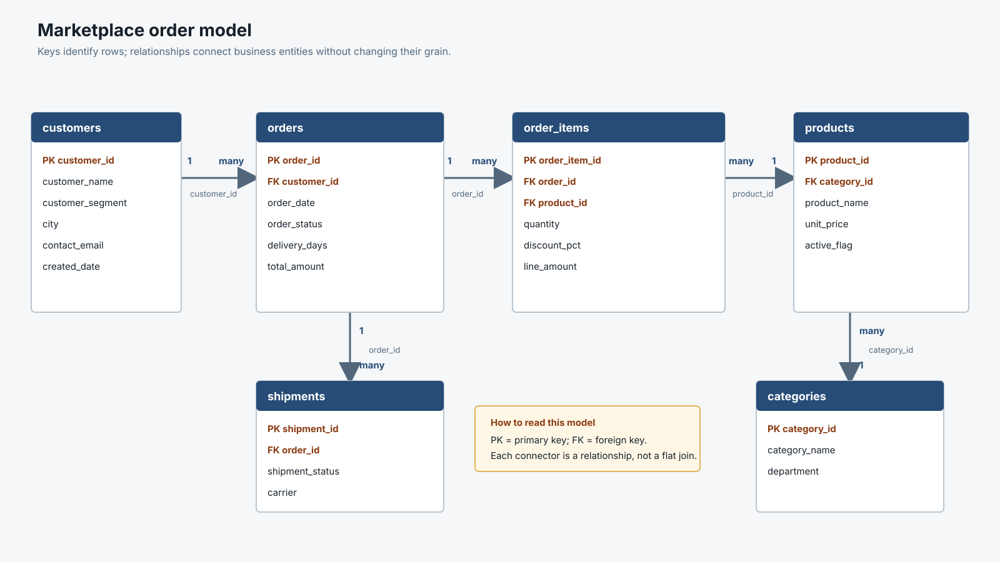

# Introduction to Data Modelling

Data modelling is the process of organizing business data so that its meaning, relationships, and measures remain clear and reliable. In this module, you will work through a fictional marketplace case study and learn how consultants move from business questions to a structure that supports trustworthy analysis.

The focus is not only on drawing tables. You will learn how to decide what one row represents, identify the entities and keys in a business process, choose appropriate relationships, and recognize when a flat table is sufficient or when a model is safer.

## Learning Objectives

By the end of this module, you should be able to:

- Define the grain of a table before using it.
- Identify entities, attributes, measures, and keys.
- Explain primary keys, foreign keys, and referential integrity.
- Read a simple entity-relationship diagram (ERD).
- Explain when a flat table is enough and when a model is safer.
- Describe 1NF, 2NF, and 3NF at an introductory level.
- Build and validate a simple star-schema relationship model.

## Case Study: Marketplace Orders

The marketplace team wants to answer four questions:

1. Which product categories generate the most revenue?
2. Which customers have the highest total spend?
3. How many orders are delivered, cancelled, returned, or pending?
4. Which orders take the longest to deliver?

The first consulting question is not “Which chart should we build?” It is:

> **What does one row represent in each dataset?**

That definition is called the **grain**.

For this case:

| Table | Grain | Key |
| --- | --- | --- |
| `customers` | One row per customer | `customer_id` |
| `categories` | One row per product category | `category_id` |
| `products` | One row per product | `product_id` |
| `orders` | One row per order | `order_id` |
| `order_items` | One row per product line within an order | `order_item_id` |
| `shipments` | One row per shipment event | `shipment_id` |

An order can contain several order items. If you join an order-level revenue value to three order-item rows, that revenue can appear three times. A declared grain helps prevent this kind of silent metric error.

## Flat Table or Data Model?

A complete table can be useful when the data is small, stable, has one clear grain, and is used for a simple analysis or one-time extract. For example, a prepared file with one row per order may be sufficient for a short operational report.

A separate model becomes more valuable when:

- Customer and product details repeat across many rows.
- Orders, payments, shipments, and products have different grains.
- Several people need reusable metrics.
- Data changes frequently.
- The dataset is growing.
- Many-to-many relationships exist.
- Data quality, governance, and reconciliation matter.

The right question is not “Is a model always better?” It is:

> **Which structure makes this business question reliable, reusable, and understandable?**

## Entities, Attributes, and Keys

An **entity** is a business object, such as a customer, product, or order. An **attribute** describes that object, such as `customer_segment`, `product_name`, or `order_status`. A **measure** is a value that can be aggregated, such as quantity or sales amount.

### Primary and Foreign Keys

- A **primary key** uniquely identifies a row, such as `orders.order_id`.
- A **foreign key** points to a key in another table, such as `orders.customer_id`.
- A **business key** comes from the business process, such as an order number generated by an order system.
- A **surrogate key** is an internal identifier created for modeling purposes.
- **Referential integrity** means that a foreign key should point to a valid record when the relationship is required.

In this case, `customers.customer_id` is the primary key of `customers`, and `orders.customer_id` is its foreign key. One customer can have many orders.

Here is a concrete key example:

| Table | Column | Role | Example |
| --- | --- | --- | --- |
| `customers` | `customer_id` | Primary key | `C001` |
| `orders` | `order_id` | Primary key | `O1001` |
| `orders` | `customer_id` | Foreign key to `customers` | `C001` |
| `order_items` | `order_item_id` | Primary key | `OI001` |
| `order_items` | `order_id` | Foreign key to `orders` | `O1001` |
| `order_items` | `product_id` | Foreign key to `products` | `P001` |

The key is not just a technical column. It answers a business question: **what makes this row different from every other row?** If `order_id` appears three times in `order_items`, that is not a duplicate key problem; it means the order contains three product lines. The unique key for that table is `order_item_id`.

The term “secondary key” can mean different things. In this module, treat it as an alternate lookup key or secondary index, not as a replacement for the primary key.

## Relationships and ERD Thinking

The marketplace relationships are shown in the ERD below. Each table includes representative columns, with primary keys (`PK`) and foreign keys (`FK`) marked directly in the table. The connectors show the expected relationship cardinality.



The diagram is intentionally closer to the kind of relationship view a consultant would review with a data or engineering team. It shows the structure of each table, not only the table names.

Read the diagram from left to right:

- `customers (1) -> orders (many)`: one customer may place many orders; every order belongs to one customer.
- `orders (1) -> order_items (many)`: one order may contain several products; every order line belongs to one order.
- `products (1) -> order_items (many)`: one product may appear on many order lines.
- `categories (1) -> products (many)`: one category contains many products.
- `orders (1) -> shipments (many)`: one order may be delivered in multiple shipment events, as shown by `O1010` in the exercise data.

In a formal ERD, the `1` and `many` markers are the **cardinality**. Optionality answers a different question: can the relationship be missing? For example, a cancelled order may have no shipment, while a delivered order should have at least one shipment record.

When reviewing an ERD, ask:

1. What does one row represent in each table?
2. Which column uniquely identifies each row?
3. Which fields connect the tables?
4. Is the relationship one-to-one, one-to-many, or many-to-many?
5. Can either side be missing?
6. Could a join multiply a measure?

An ERD is valuable because it gives analysts, engineers, and stakeholders a shared picture of how business objects relate.

## Normalization: 1NF, 2NF, and 3NF

Imagine storing customer name, product name, category, and order details in one wide table. Customer and product values would be repeated across many rows. Changing a customer’s city would require updating multiple records, and deleting the last order could accidentally remove the only stored copy of a product relationship.

### Worked example: one table before normalization

We will use one order example all the way through the normalization steps. The original extract stores more than one product in a cell. Its grain is **one row per order**, not one row per product line:

**Before normalization: unnormalized table**

| order_id | customer_id | customer_city | product_ids | product_names | quantities | category_names |
| --- | --- | --- | --- | --- | --- | --- |
| O1001 | C001 | Bengaluru | P001, P004 | Wireless Mouse, Notebook Set | 2, 1 | Accessories, Stationery |
| O1002 | C002 | Mumbai | P002 | USB C Hub | 1 | Accessories |

This table is difficult to query because the values in `product_ids`, `product_names`, `quantities`, and `category_names` are lists. A consultant cannot safely count product lines or calculate revenue without first separating those values.

#### 1NF: remove repeating groups

**Before 1NF:** each order stores multiple products and quantities in one row.

**After 1NF:** each cell contains one value and each product line becomes its own row. At this stage, it is still one wide table, so customer and product details are repeated:

| order_id | line_number | customer_id | customer_city | product_id | product_name | category_name | quantity | unit_price |
| --- | ---: | --- | --- | --- | --- | --- | ---: | ---: |
| O1001 | 1 | C001 | Bengaluru | P001 | Wireless Mouse | Accessories | 2 | 25 |
| O1001 | 2 | C001 | Bengaluru | P004 | Notebook Set | Stationery | 1 | 18 |
| O1002 | 1 | C002 | Mumbai | P002 | USB C Hub | Accessories | 1 | 45 |

For this simplified example, use the combination `order_id + product_id` as the composite business key for the 1NF table. `line_number` identifies the line's position within the order, but it is not the key used for the normalization explanation. In the repository dataset, the same row-identification role is represented by the unique `order_item_id`.

#### 2NF: remove partial dependencies

**Before 2NF:** the 1NF table uses the same `order_id + product_id` composite business key. `customer_id` and `customer_city` depend only on `order_id`; `product_name` and `category_name` depend only on `product_id`. These attributes do not depend on the whole key.

**After 2NF:** move order-level attributes to `orders`, product-level attributes to `products`, and leave line-level attributes in `order_items`:

**Orders**

| order_id | customer_id | customer_city |
| --- | --- | --- |
| O1001 | C001 | Bengaluru |
| O1002 | C002 | Mumbai |

**Products**

| product_id | product_name | category_name |
| --- | --- | --- |
| P001 | Wireless Mouse | Accessories |
| P002 | USB C Hub | Accessories |
| P004 | Notebook Set | Stationery |

**Order items**

| order_id | product_id | quantity | unit_price |
| --- | --- | ---: | ---: |
| O1001 | P001 | 2 | 25 |
| O1001 | P004 | 1 | 18 |
| O1002 | P002 | 1 | 45 |

Now each non-key attribute depends on the table’s complete key. Order facts are stored once per order, product facts once per product, and line facts once per order-product combination.

#### 3NF: remove transitive dependencies

**Before 3NF:** the 2NF `products` table stores `category_name`. However, `category_name` depends on `category_id`, not directly on `product_id`. If the category name changes, multiple product rows could require updates.

**After 3NF:** introduce a separate `categories` table and keep only `category_id` in `products`:

**Products**

| product_id | product_name | category_id |
| --- | --- | --- |
| P001 | Wireless Mouse | CAT01 |
| P002 | USB C Hub | CAT01 |
| P004 | Notebook Set | CAT03 |

**Categories**

| category_id | category_name |
| --- | --- |
| CAT01 | Accessories |
| CAT03 | Stationery |

The final dependency chain is `product_id -> category_id -> category_name`, so the category name is stored once. This is the practical idea behind **Third Normal Form (3NF)**: non-key attributes depend on the key of their own table, not on another non-key attribute.

The complete progression is:

```text
Unnormalized order table
     ↓ 1NF: split list values into rows
One wide table at product-line grain
     ↓ 2NF: split attributes by full-key dependency
Orders + Products + Order items
     ↓ 3NF: split transitive category dependency
Orders + Products + Categories + Order items
```

Normalization reduces these anomalies.

- **1NF:** Each field contains one value, and repeating groups are removed.
- **2NF:** Every non-key attribute depends on the whole key. This matters especially when a table has a composite key such as `order_id` plus `product_id`.
- **3NF:** Non-key attributes depend on the key, not on another non-key attribute. For example, category name belongs with the category identifier rather than being repeated as a product-level fact.

The normalized design separates the data into `customers`, `categories`, `products`, `orders`, and `order_items`. This improves update consistency and makes the business relationships explicit.

Normalization is not a goal by itself. A normalized operational model is useful for reliable updates; an analytical model may intentionally combine descriptive fields to make analysis easier.

## From Relational Tables to a Star Schema

Operational systems are commonly designed for transactions. Analytical models are designed for questions and aggregations. See [OLTP and OLAP concepts](../data-processing/data-concepts) for the broader distinction.

A simple star schema for this case would use:

- `fact_sales` or `order_items` as the fact table.
- `dim_customer` for customer context.
- `dim_product` for product context.
- `dim_category` for category context.
- `dim_date` for calendar analysis.
- `dim_order_status` for order-status reporting.

The fact-table grain should be stated explicitly:

> **One row in the sales fact represents one product line within one customer order.**

Facts contain measurable events such as quantity, sales amount, and discount. Dimensions provide the descriptive context used to filter and group those events.

### Star or Snowflake?

Choose a **star schema** when analysts need a simple model with fewer joins, clear dimensions, and straightforward dashboard queries.

Consider a **snowflake schema** when dimension hierarchies are shared, highly repetitive, or need stronger normalization and governance. The trade-off is additional joins and a model that may be harder for a new analyst to navigate.

Other patterns exist, including a normalized 3NF model, a wide denormalized table, a constellation or galaxy schema, and bridge tables for many-to-many relationships. At this level, the important skill is recognizing the trade-off and choosing deliberately.

## Tableau Exercise: Construct the Logical Layer

Download the fictional exercise files:

- [customers.csv](/assets/data/data-modeling/customers.csv)
- [categories.csv](/assets/data/data-modeling/categories.csv)
- [products.csv](/assets/data/data-modeling/products.csv)
- [orders.csv](/assets/data/data-modeling/orders.csv)
- [order_items.csv](/assets/data/data-modeling/order_items.csv)
- [shipments.csv](/assets/data/data-modeling/shipments.csv)

These files contain fictional data only. Their purpose is to help you inspect keys, relationships, grain, and metric behavior. Keep all six files in one local folder after downloading them.

### Consultant Workflow in Tableau Desktop

1. Install Tableau Desktop or use the educational/trial option available to you. Tableau’s menus may differ slightly by version.
2. Download all six CSV links above and place them in the same local folder. Do not rename the columns.
3. Open Tableau and choose **Connect to Data > Text file**. Select one CSV, then open the **Data Source** page.
4. Drag the remaining files onto the **logical canvas**. At this stage, each box represents a business table, not a physical SQL join.
5. Relate `customers` to `orders` using `customer_id`.
6. Relate `orders` to `order_items` using `order_id`.
7. Relate `order_items` to `products` using `product_id`.
8. Relate `products` to `categories` using `category_id`.
9. Relate `orders` to `shipments` using `order_id`. Note that `O1010` has two shipment rows, so this relationship is intentionally one-to-many.
10. Open each relationship and review the matching fields, expected cardinality, and referential-integrity assumption. Tableau relationships describe query behavior; they do not repair invalid keys.
11. Double-click a logical table only when you need to inspect the **physical layer**. Use a physical join only if you can state the resulting grain in one sentence.
12. Create a validation worksheet with `COUNTD(order_id)`, `SUM(quantity)`, and sales calculated as `quantity * unit_price * (1 - discount_pct / 100)`.
13. Add customer, product, category, and shipment fields one at a time. Watch whether order count, quantity, or sales changes unexpectedly.
14. Investigate duplicate keys, orphan foreign keys, null shipment fields, row multiplication, or changed totals.
15. Save a screenshot of the completed logical model and record the table grains, keys, cardinality assumptions, and validation results.

### Target Model Screen

Your Tableau Data Source page should communicate this structure:

```text
customers (1) ────< orders (many) ────< order_items (many) >──── products (1)
                                      products (many) >──── categories (1)
orders (1) ────< shipments (many)
```

In the Tableau screen, `orders` and `order_items` are the central business-event tables. `customers`, `products`, and `categories` provide descriptive context. `shipments` is a separate event table and must not be flattened into order lines without checking its grain.

For the analytical interpretation, the same source can be represented as a star schema:

```text
                         dim_customer
                              |
dim_category ─── dim_product ─── fact_sales
                                      |
                           dim_date / dim_order_status
```

The screen is successful when another consultant can identify the table grain, key fields, relationship paths, and possible row-multiplication risks without asking the model author. Tableau is being used to make the model visible and testable; the same reasoning applies in SQL, Power BI, and Python.

### What This Builds Toward

The validated model becomes the foundation for a later analytics product. A future BI module can use the model to define reusable metrics, create analytical views, build dashboards, publish reports, and manage refresh and governance. This module stops at the logical model, relationships, and validation so that the later product work starts from trusted structure rather than an unexplained flat file.

## Exercise Questions

1. When would the marketplace data be suitable for one complete flat table, and when would separate tables be safer?
2. What is the grain of `order_items`? Which columns are its key and foreign-key fields?
3. Why can joining order-level data directly to multiple order-item rows duplicate revenue?
4. For a self-service sales analysis, when would you choose a star schema instead of a snowflake schema?

Use your model and worksheet results to write a short consultant recommendation. Include the assumptions that another analyst would need in order to reproduce your numbers.

## Modeling Checklist

- Is the grain of every table documented?
- Are primary keys unique?
- Do foreign keys match valid parent records?
- Are relationships and cardinality explicit?
- Are measures stored at a compatible grain?
- Do order count, quantity, and revenue reconcile after relationships are added?
- Can another analyst understand the model without asking its author?

## Further Reading

- [What is data modeling?](https://www.data-mania.com/blog/what-is-data-modeling-data-modeling-vs-data-analysis-101/)
- [Domain-driven data modeling](https://hackolade.com/domain-driven-data-modeling.html)
