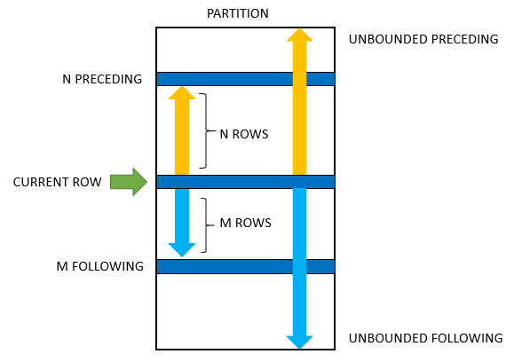

# Advanced SQL: Window and Aggregate Functions

There are a lot of interesting functions to transform and add properties to your dataset


* What limitations have you faced in your analytics when using GROUP BY in the past?
* How can you do rankings per each category efficiently?
* How can you get the entire row of the best-selling product? (imagine you want to see additional attributes of this product)


In SQL, window functions and aggregate functions are powerful tools that allow you to perform complex calculations on your data. In this guide, we'll cover the basics of these functions and show you how to use them to get the most out of your SQL queries.

## Aggregate Functions

Aggregate functions allow you to perform calculations on a set of values and return a single result. Some of the most common aggregate functions include:

- `SUM`: Calculates the sum of all values in a given column.
- `AVG`: Calculates the average of all values in a given column.
- `MIN`: Returns the minimum value in a given column.
- `MAX`: Returns the maximum value in a given column.
- `COUNT`: Returns the number of rows in a given column.

<div style={{textAlign: 'center'}}>


</div>

Here's an example of how you might use an aggregate function in SQL:

```sql
SELECT COUNT(*) 
FROM customers;
```

This query returns the total number of rows in the `customers` table.

## Window Functions

Window functions are a type of function that allows you to perform calculations across a set of rows that are related to the current row. Some of the most common window functions include:

- `ROW_NUMBER`: Returns the number of the current row within its partition.
- `RANK`: Returns the rank of the current row with its partition.
- `DENSE_RANK`: Returns the rank of the current row within its partition, with ties receiving the same rank and leaving gaps.
- `LEAD`: Returns the value of a given column for the next row in the partition.
- `LAG`: Returns the value of a given column for the previous row in the partition.

<div style={{textAlign: 'center'}}>



</div>

Here's an example of how you might use a window function in SQL:

```sql
SELECT first_name, last_name, salary, 
       ROW_NUMBER() OVER (ORDER BY salary DESC) as row_number 
FROM employees;
```

This query returns the `first_name`, `last_name`, and `salary` columns from the `employees` table, along with a `row_number` column that indicates the number of the current row within its partition.

## Conclusion

Aggregate and window functions are powerful tools that can help you to perform complex calculations on your SQL data. By mastering these functions, you can gain a deeper understanding of your data and create more insightful reports and visualizations.