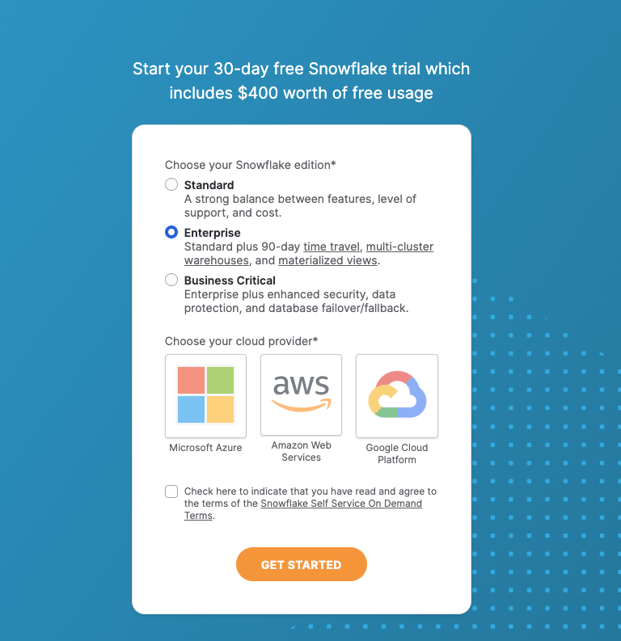
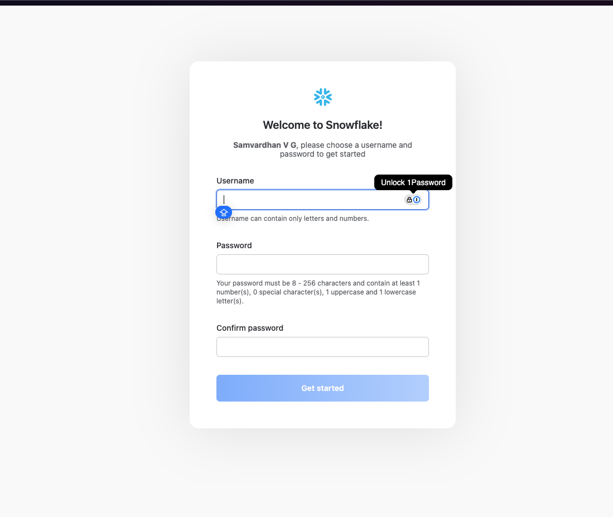
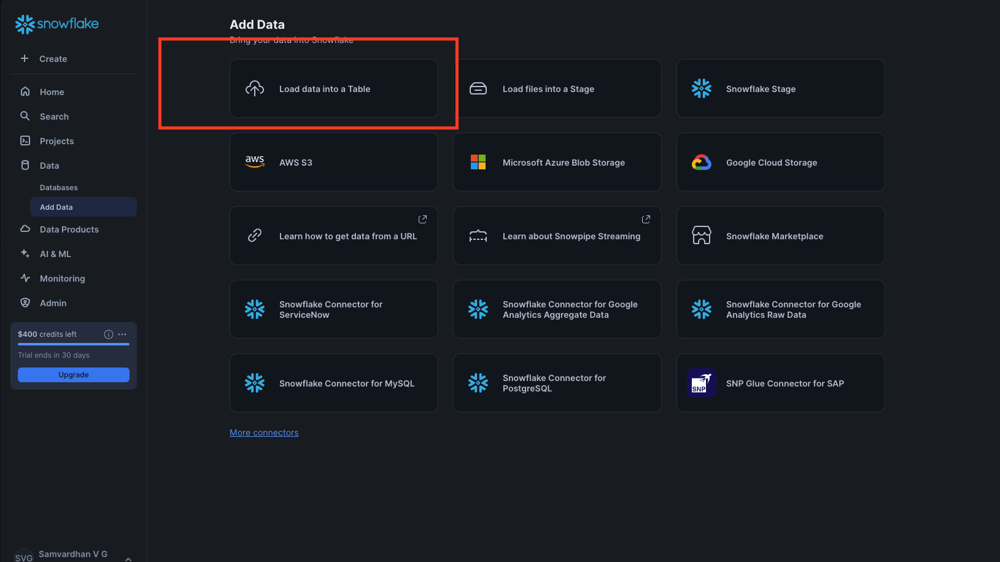
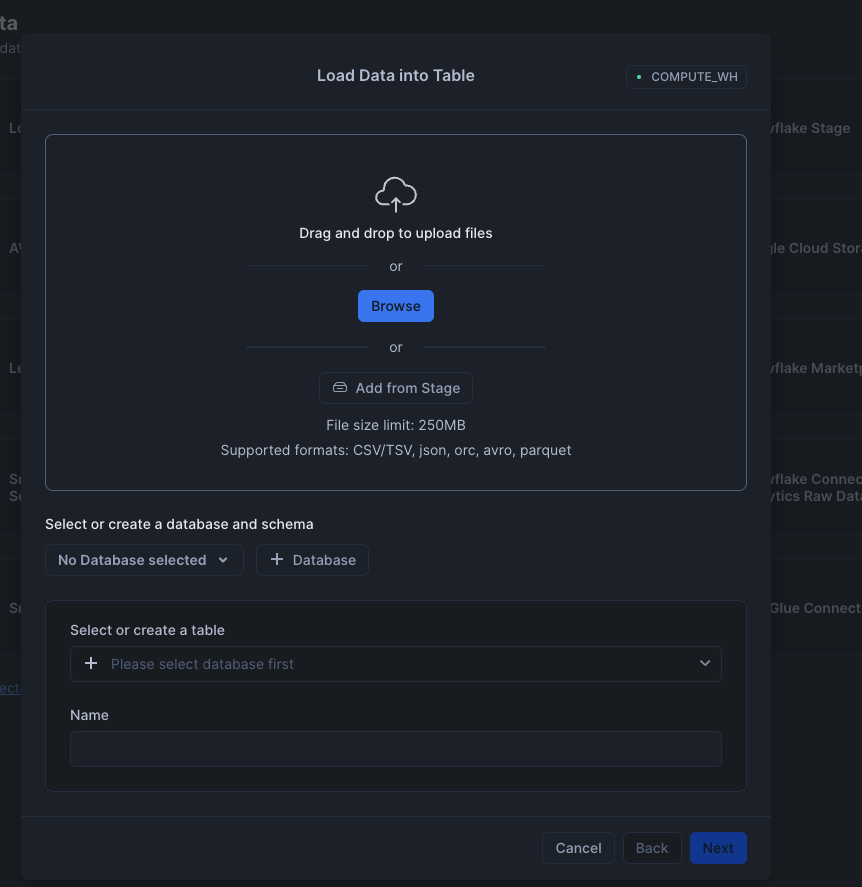
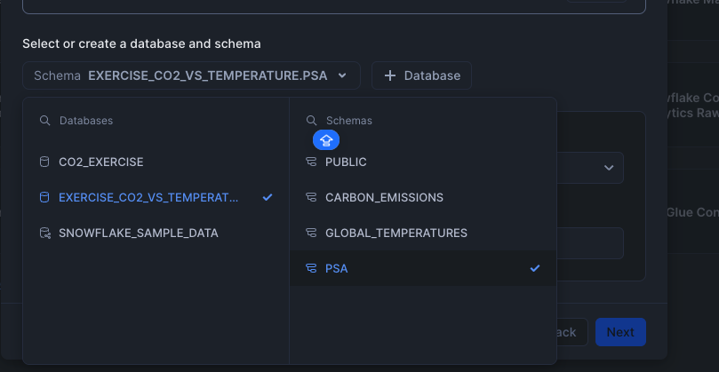

# Data Analyst Workshop Setup

Welcome to the Data Analyst Workshop! Follow the steps below to set up your Snowflake environment and load the necessary data files.

## Step 1: Create a Free Tier Account on Snowflake

1. Go to [Snowflake's Free Trial Signup](https://signup.snowflake.com/) and sign up for a free trial account.

2. Follow the instructions in your email to activate your account and log in to Snowflake.

## Step 2: Follow the Readme.md in the below repo

https://github.com/Data-Navigators/Data_Processing/blob/main/README.md

Once these steps are complete, your Snowflake environment will be set up with the necessary data for the workshop!
