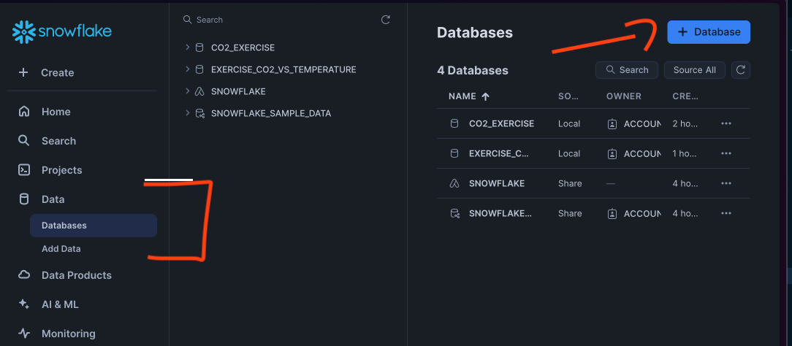
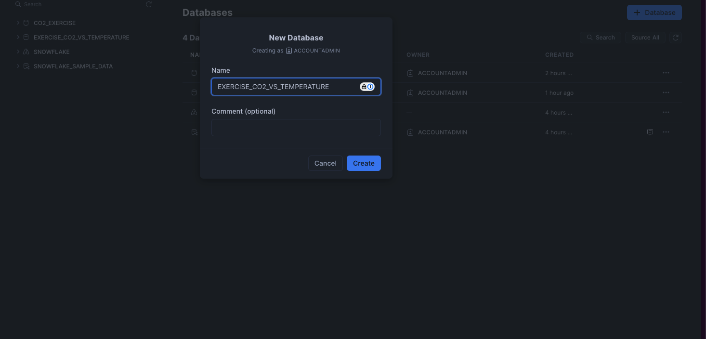
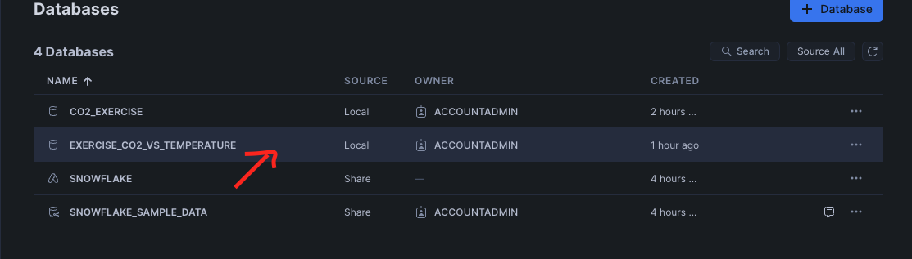
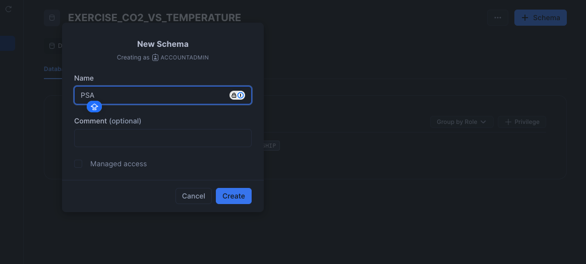
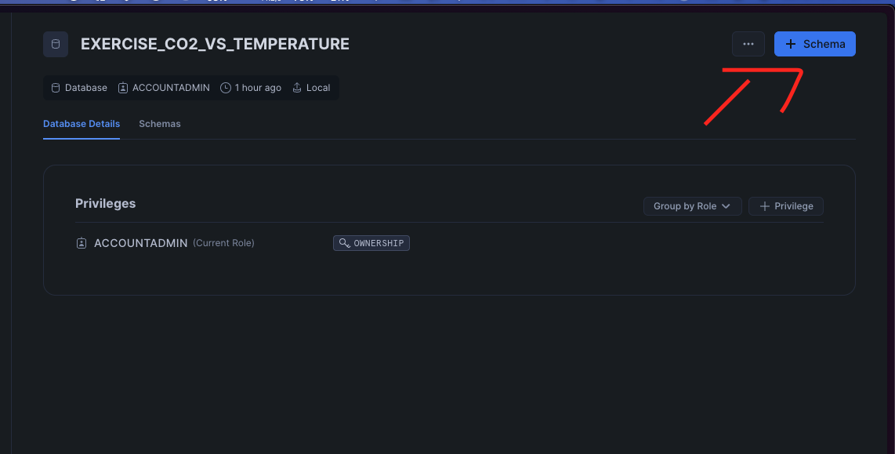

# Data Analyst Workshop Setup

Welcome to the Data Analyst Workshop! Follow the steps below to set up your Snowflake environment and load the necessary data files.

## Step 1: Create a Free Tier Account on Snowflake

1. Go to [Snowflake's Free Trial Signup](https://signup.snowflake.com/) and sign up for a free trial account.


2. Follow the instructions in your email to activate your account and log in to Snowflake.


## Step 2: Create a Database

Once logged in, create a new database to store your data.

- **Database Name**: `EXERCISE_CO2_VS_TEMPERATURE`

To create this database:
```sql
CREATE DATABASE EXERCISE_CO2_VS_TEMPERATURE;
```

**OR**







## Step 3: Create Schemas

Inside the database, create the following schemas to organize your data:

- **Schemas**:
  - `PSA`
  - `GLOBAL_TEMPERATURES`
  - `CARBON_EMISSIONS`

To create these schemas:
```sql
USE DATABASE EXERCISE_CO2_VS_TEMPERATURE;

CREATE SCHEMA PSA;
CREATE SCHEMA GLOBAL_TEMPERATURES;
CREATE SCHEMA CARBON_EMISSIONS;
```

**OR**

You can also create schemas using the Snowflake web interface:








## Step 4: Download the CSV Files

Clone the GitHub repository to access the necessary data files:


**Update Homebrew**  
   Open Terminal and update Homebrew to ensure you're getting the latest packages:
   ```bash
   brew update
   ```

**Install Git LFS**  
   Use Homebrew to install Git LFS:
   ```bash
   brew install git-lfs
   ```
For more details and documentation, refer to the official Git LFS website: [link](https://git-lfs.github.com/)

```bash
git clone https://github.com/Data-Navigators/Data_Processing.git
```


```bash
cd data
```

This will download the following CSV files:

- `EMISSIONSBYCOUNTRY.csv`
- `GLOBALTEMPERATURES.csv`
- `TEMPERATURESBYCOUNTRY.csv`

## Step 5: Load Data into Snowflake

Load the downloaded CSV files into the `PSA` schema within your Snowflake database.

### File to Table Mapping

| CSV File                    | Schema | Table                   |
|-----------------------------|--------|-------------------------|
| `EMISSIONSBYCOUNTRY.csv`    | PSA    | `EMISSIONBYCOUNTRY`     |
| `GLOBALTEMPERATURES.csv`    | PSA    | `GLOBALTEMPERATURES`    |
| `TEMPERATURESBYCOUNTRY.csv` | PSA    | `TEMPERATURESBYCOUNTRY` |

### Steps to Load Data

For each CSV file, run the following commands:

1. **Create Tables** in the `PSA` schema.
   ```sql
   USE SCHEMA PSA;

   CREATE TABLE EMISSIONBYCOUNTRY (...); -- Define columns based on your data
   CREATE TABLE GLOBALTEMPERATURES (...); -- Define columns based on your data
   CREATE TABLE TEMPERATURESBYCOUNTRY (...); -- Define columns based on your data
   ```

2. **Load Data** from the local files:
   - You can use Snowflake's data loading utilities, such as SnowSQL or the Snowflake UI, to upload each CSV to its respective table.


Once these steps are complete, your Snowflake environment will be set up with the necessary data for the workshop!
