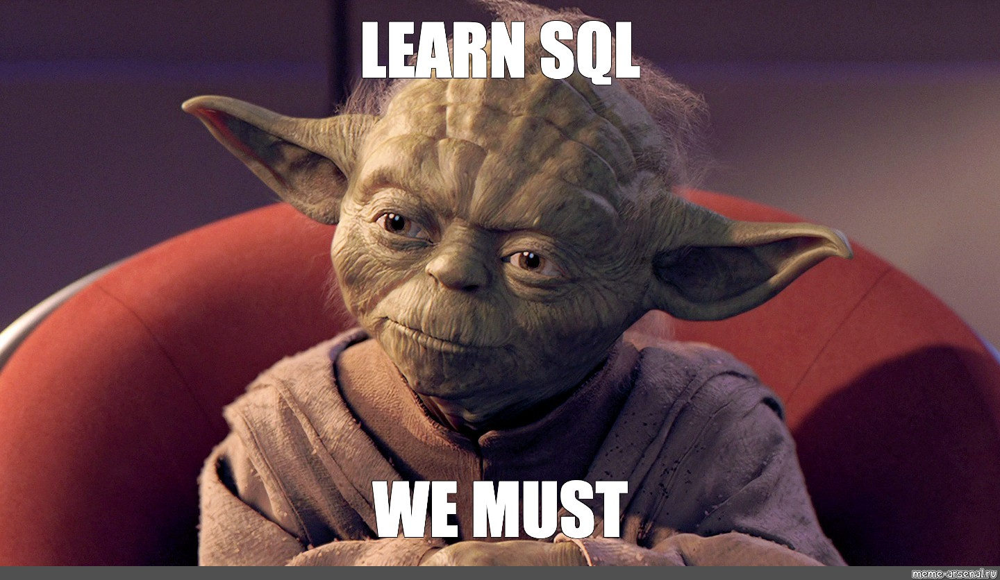
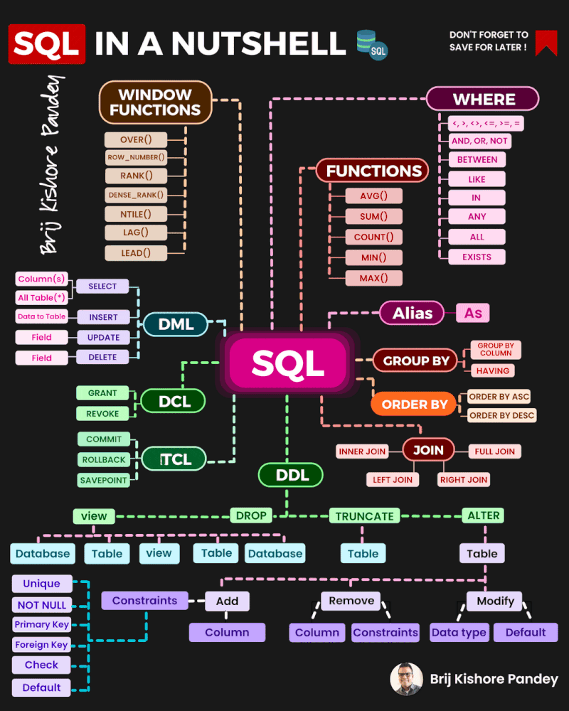

# SQL: A Quick Review 

# Basic SQL

SQL is a programming language used to manage and manipulate relational databases. It is used to create, read, update, and delete data in a database. SQL is widely used in data analysis, business intelligence, and web development. Its syntax is simple and easy to understand, making it a popular choice for data professionals.

<div style={{textAlign: 'center'}}>



</div>

## SQL Nutshell 🌏



### Creating Tables

To create a table in Snowflake, use the following syntax:

```sql
CREATE TABLE table_name (
  column1 data_type,
  column2 data_type,
  ...
);
```

Example:

```sql
CREATE TABLE customers (
  customer_id INT,
  customer_name VARCHAR,
  email VARCHAR,
  phone_number VARCHAR
);

CREATE TABLE orders (
  order_id INT,
  customer_id INT,
  order_date DATE,
  total_amount DECIMAL(10, 2)
);
```

### Creating Views

To create a view in Snowflake, use the following syntax:

```sql
CREATE VIEW view_name AS
SELECT column1, column2, ...
FROM table_name
WHERE condition;
```

Example:

```sql
CREATE VIEW order_details AS
SELECT o.order_id,
       o.order_date,
       c.customer_name,
       c.email
FROM orders AS o
INNER JOIN customers AS c
   ON o.customer_id = c.customer_id;
```

Note: Replace `table_name`, `view_name`, `column1`, `column2`, and `condition` with the appropriate names and conditions for your use case.


## Reserved & Limited Keywords

Snowflake SQL reserves all ANSI keywords (with the exception of type keywords such as CHAR, DATE, DECIMAL, etc.), as well as some additional keywords (ASC, DESC, MINUS, etc.) that are reserved by other popular databases. Additionally, Snowflake reserves keywords REGEXP and RLIKE (which function like the ANSI reserved keyword LIKE) and SOME (which is a synonym for the ANSI reserved keyword ANY).

To avoid parsing ambiguities, Snowflake SQL also prohibits the use of keywords such as LEFT, OUTER, JOIN, etc. as table names or aliases in the FROM list, and the use of keywords such as TRUE, FALSE, CASE, etc. as column references in scalar expressions.

eg. ACCOUNT,BETWEEN,SAMPLE,TABLE,WHENEVER 

[Referrence Link](https://docs.snowflake.com/en/sql-reference/reserved-keywords)


## Join types

Data cleansing and enrichment processes need to combine, filter, aggregate, and select different sets to answer questions we have. That translates into knowing how to perform different types of JOINs and WHERE clauses to simple SELECT statements. First and foremost, we need to get up to speed with JOINs.

Let’s imagine for a minute that we have customers and orders tables, which are related by the `customers_id` field:

<div style={{textAlign: 'center'}}>


</div>


### INNER JOIN

You want all orders but also want to know the name of the customer who ordered.

```sql
SELECT a.order_id
     , a.customer_id
     , b.customer_name
FROM example.orders AS a
INNER JOIN example.customers AS b
   ON a.customer_id = b.customer_id;
```

### LEFT “OUTER” JOIN

In this case, you want all orders, even if they have a customer associated or not (let’s not dig into data integrity issues here for the sake of simplicity of this example).

```sql
SELECT o.order_id
     , o.customer_id
     , c.customer_name
FROM example.orders AS o
LEFT [OUTER] JOIN example.customers AS c
   ON o.customer_id = c.customer_id;
```

Some database engines do not require you to specify `OUTER`.

### RIGHT “OUTER” JOIN

All customers with or without any orders.

```sql
SELECT o.order_id
     , o.customer_id
     , c.customer_name
FROM example.orders AS o
RIGHT [OUTER] JOIN example.customers AS c
   ON o.customer_id = c.customer_id;
```

Order is important for LEFT and RIGHT join. This query will bring us all `example.customers` rows and whatever matches with `example.orders`.

### LEFT ANTI SEMI JOIN and LEFT OUTER JOIN (with exclusion)

Let’s say you want all customers who haven’t ordered anything yet.

```sql
SELECT c.customer_id
     , c.customer_name
FROM example.customers AS c
WHERE NOT EXISTS (SELECT o.customer_id
                  FROM example.orders AS o
                  WHERE c.customer_id=o.customer_id);
```

```sql
SELECT c.customer_id
     , c.customer_name
FROM example.customers AS c
LEFT [OUTER] JOIN example.orders AS o
   ON c.customer_id = o.customer_id
WHERE o.customer_id IS NULL;
```

Always do performance tests on your queries and subqueries. Join performance depends on table structure, indexes, and generated query plans.

### CROSS JOIN

Cross join returns the Cartesian product of both tables, meaning it will bring all possible combinations between all the elements of both sets.

```sql
SELECT c.customer_id
	, c.customer_name
	, o.order_id
FROM example.orders AS o
CROSS JOIN example.customers AS c;
```

There are other ways to combine datasets, but both query parts need to have the same structure:

- UNION
- UNION ALL
- EXCEPT
- INTERSECT


# Datatype Cast in SQL

## Overview
Datatype casting in SQL is used to convert values from one data type to another. It's essential for handling data stored in various formats.

## Syntax
The `CAST()` function is commonly used for casting:
```sql
CAST(expression AS target_datatype)
```

Alternatively, use the shorthand `::` operator:
```sql
expression::target_datatype
```

## Key Points
- Casting aligns with `TO_datatype` conversion functions.
- An error is raised if the cast is not possible due to data type incompatibility.
- Examples:
  - Convert string to integer: `CAST('123' AS INT)` or `'123'::INT`.
  - Convert date to string: `CAST(NOW() AS VARCHAR)` or `NOW()::VARCHAR`.


## Extracting Year from a Date String in SQL

In SQL, you can convert a date string to a timestamp and then extract the year part from it. This is particularly useful when you have date information as a string and need to extract specific components like the year.

### Function Explanation

- `to_timestamp("DATE", 'MM-dd-yyyy')`: Converts a date string in the 'MM-dd-yyyy' format to a timestamp. For example, '12-25-2020' would be converted to a timestamp representing 25th December 2020.
- `year(...)`: Extracts the year part from the timestamp.

### SQL Query Example

Consider a table named `example_table` with a column `DATE` containing date strings in the 'MM-dd-yyyy' format. To select these dates and extract the year from each one, use the following SQL query:

```sql
SELECT 
    DATE, 
    year(to_timestamp(DATE, 'MM-dd-yyyy')) AS Year 
FROM 
    example_table;
```

### Expected Output

Given the following sample data in `example_table`:

| DATE       |
|------------|
| 12-25-2020 |
| 07-04-2019 |
| 01-01-2018 |

The query would return:

| DATE       | Year |
|------------|------|
| 12-25-2020 | 2020 |
| 07-04-2019 | 2019 |
| 01-01-2018 | 2018 |

This method allows you to efficiently extract the year from a date string formatted as 'MM-dd-yyyy' in SQL.

> **Note:** 
- Familiarize with your SQL database's supported data types.
- Validate data before casting to prevent errors.
- Be aware of potential data truncation or rounding in some conversions.


If you want to change granularity levels on your data and also summarize it, go [here](https://en.wikipedia.org/wiki/SQL_window_function) and [here](https://docs.microsoft.com/en-us/sql/relational-databases/window-functions/quickstart-window-functions-by-example?view=sql-server-ver15) to start your learning path.

Many core concepts can be learned from websites like [W3C](https://www.w3schools.com/sql/default.asp). If you want to challenge yourself with practical exercises, you can take a look [here](https://pgexercises.com/) too.


