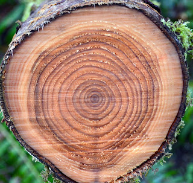
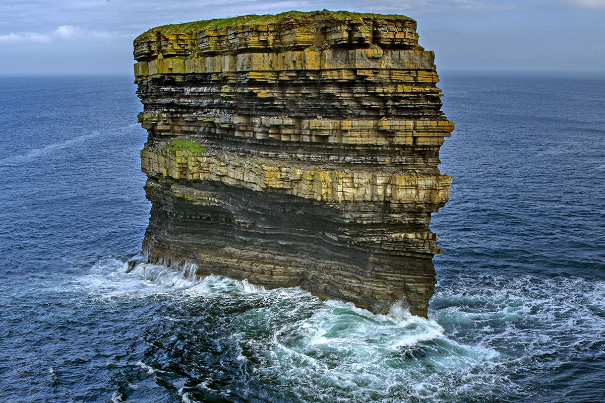

# What is Visualization?

## Art of storytelling using Visualization

Visualization is the process of representing information visually to enable the audience to understand it with little to no additional explanation or briefing, Such that a person wi.

The concept of visualization started as data representation of statistical data in a graphical format. Today it has evolved into a separate art by itself and has it use cases in wide range of fields like statistics, business, medical science, research, geography, etc. The concept of Data visualization can be not only be limited to graphical representation alone, It is indeed used to brief a complex concept in a simpler way. 

Now let us look at the following images,  note down what comes to your mind by looking at the images ?

<h3 style={{textAlign:"center"}}>Sliced Tree</h3>

  
  
  
  
  
  
  

<h3 style={{textAlign:"center"}}>Rock by the Sea</h3>

pause for a minute and, before scrolling down, think about what you see in the images.

  
  
  
  
  
  
  

### what did you observe ?

The understanding of the image without proper description and legends depends on many factors such as audience knowledge, perception , briefing and so on. Now let us look at the same images with some different description.

<h3 style={{textAlign:"center"}}>Years of Growth</h3>

The cross-section of a tree reveals its growth rings,
Each ring represents a year of growth, and the width of the rings can indicate the tree's health during that time.
The thickness of the rings indicates the amount of growth that occurred in a given year, with wider rings suggesting favorable conditions and narrower rings indicating stress or adverse conditions.
The study of tree rings is known as dendrochronology.

  

<h3 style={{textAlign:"center"}}>Millions of years</h3>

The rock formation you see is a sea rock stack, you can see the layers of sedimentary rock that have been deposited over millions of years. each layer represents a different period in our Earth's history, with the oldest layers at the bottom and the youngest at the top.You can also observe the erosion patterns on the rock by the sea, which has changed the shape of the rock over time.
The study of rock layers and formations is known as stratigraphy.

  
  

### Observation
Imagine this, 
Can the description alone make the audience understand the concept of tree rings and sea stacks? Might not.   
Similarly can the image alone make the audience understand the concept of tree rings and sea stacks? Might not.  
  
But the combination of visual images and text description can make the audience understand the concept of tree rings and sea stacks with minimal briefing. Now you can understand the art of storytelling using visualization. The same learning can be used to explain a complex data in a simpler way in Data Analysis.In the next sections,we will see how to use visualization to tell a story using data.
