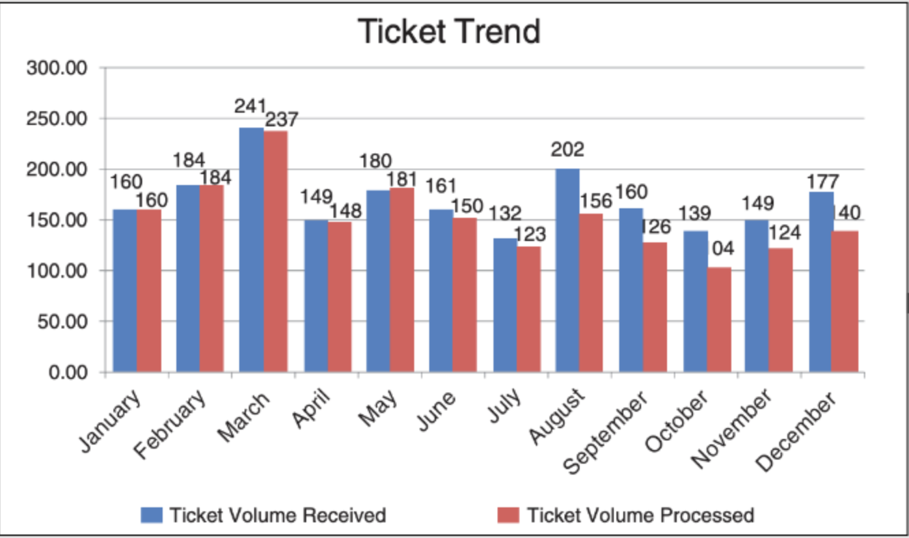
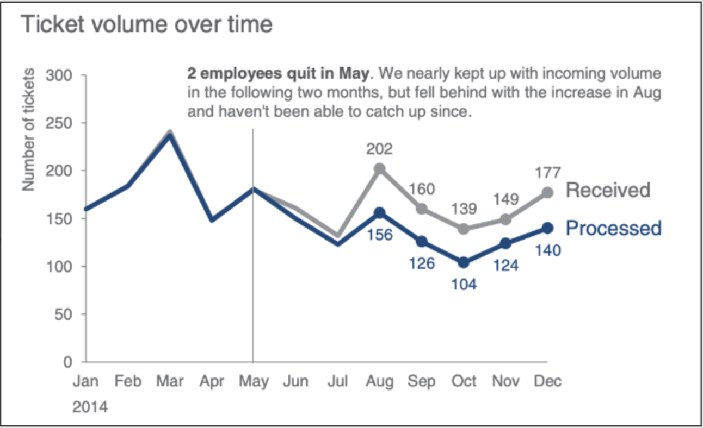

# Visualization using data

Now continuing with our data visualization ...  
In Data analyst role, one of our primary goal is to analyze and understand the data available, 
connecting the dots and find the patterns, trends, and outliers in the data and finally provide our recommendations, set of action items, actionable report or outcomes for all of these delivery items we use data visualization so that the information
we are trying to convey is easily understandable and convey the full information to the stakeholders.

From our previous learning, from the raw data available, after Data Processing, We have the analyzed data in a simple table format or any other textual format, but the business stake holders may not be able to understand the data in format we have, as the knowledge of business stakeholders will vary based on their understanding. At the same time, our responsibility is to make Business quick decision for corresponding  opportunities or measures.

As a data analyst, we need to convey maximum information with the analyzed data to business stakeholders, so that business stakeholders can take quick decisions and change business growth trajectory.

## Visualization approach

Whenever we are planning to represent the data in a visual format, we need to have the knowledge of the following:
- What is the goal of the visualization?
    * The goal is to show the relationship between two or more variables?
    * The goal is to ask a hidden question to the stakeholders ?
    * The goal is make the stakeholders understand the cost / impact of the feature we are trying to implement?

- Who is the target audience?
    * The target audience is the business stakeholders 
    * The target audience is individual / team with technical knowledge?
    * The target audience is General public

- In which method the data visualization is going to be interpreted ?
    * Is the data representation is needed for in person briefing?
    * Is the data representation is going to be self understood in async way daily?
    * Is the data representation is going going to be continuously updated periodically?

All the above questions plays an important role in representing the data visualization, we need to tailor the data visualization based on the above answers.

For example, if the target audience is a business stakeholder and the goal is to show the relationship between two or more variables, then we can use a simple scatter plot or line graph with detailed description and label briefing. 
If the goal is to ask a hidden question to the stakeholders, all our representation should be focused on the question we are trying to ask.
If the target audience is a general public, Then the terms and legends used in the data representation should be simple and easy to understand, etc.

The below list of attributes are very important to be considered while representing the data visualization.
- Title: A good title to the representation, which itself explains the crux of data representation
- Legend: Either in the same page or in separate page, explaining the abbreviations, color codes, X and Y axis representation, etc.
- Source: The source or reference of the data used for the representation, as stakeholders may dig deeper into the data for further analysis
- Annotations: Ideally data representation should be self explanatory, but if needed on case by case basis,we can add some annotations to the data representation to make it more understandable

## Example: Support Team Volume Received and Processed Tickets

Goal: The product support team is having a challenge of managing the volume of tickets received and processed, As a data analyst, we need to help the support team in understanding the volume of tickets received and processed, and also help them in identifying the bottlenecks in the process.

We have collected the data from the support team for the year 2024, and we have the following data available.

| Month      | Ticket Volume Received | Ticket Volume Processed |
|------------|-------------------------|--------------------------|
| January    | 160                     | 160                      |
| February   | 184                     | 184                      |
| March      | 241                     | 237                      |
| April      | 149                     | 148                      |
| May        | 149                     | 180                      |
| June       | 181                     | 161                      |
| July       | 123                     | 132                      |
| August     | 202                     | 160                      |
| September  | 156                     | 126                      |
| October    | 139                     | 124                      |
| November   | 104                     | 140                      |
| December   | 149                     | 177                      |

Can you think of a  way to represent the data in a more understandable visual representation format?
  
  
  
  
  
  
  
  
  

### Bar chart representation
Let us take the visualization of the data step by step...
- We have two variables to represent the data,
    - Ticket Volume Received 
    - Ticket Volume Processed
- The two variables is referenced with respect to the month of the year

Let us get started with a simple bar chart to represent the two variables with respect to the month of the year.

#### Bar chart observations
Let us observe the above representation, and see if we can get any insights from the data representation before we scroll down.
- The volume of tickets received and processed is almost same for the month of January to May
- Starting from the month of June, the volume of tickets received is more than the volume of tickets processed

### Further Analysis
After checking with the support team what changed in may month, we understood that there was a attrition in the team and the team was short of a resource starting from the month of June.
Now let us try to represent the data in a different way, and see if we can get any insights from the data representation.
Let us try to represent the data as a line chart, and see if we can get any insights from the data representation.

#### Line chart observations
- The deviation of the volume of tickets received and processed is almost same for the month of January to May
- Deviations Starting from the month of June is clearly visible, added a annotation to brief the same
- The deviation in August month is more than the deviation compared to the reset of the months

### Further Analysis
Still we have identified only few insights from the data, we do not have the answers for all the reasons for the deviation.
- Why the deviation is so much in the month of August?
    - Is there any new release ?
    - Was there any technical issue ?
    - Was there a incorrect sales pitch done by the sales team?

Also to be noted is that, if the features are same and the people who are handling the tickets are same, then the time taken to process the tickets should decrease over time.

#### Additional Knowledge
What are the factors slowing down the ticket processing? Are these factors correlated? [Correlation is NOT causation](https://www.youtube.com/watch?v=ROpbdO-gRUo)