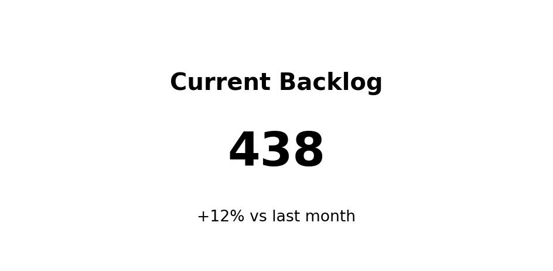
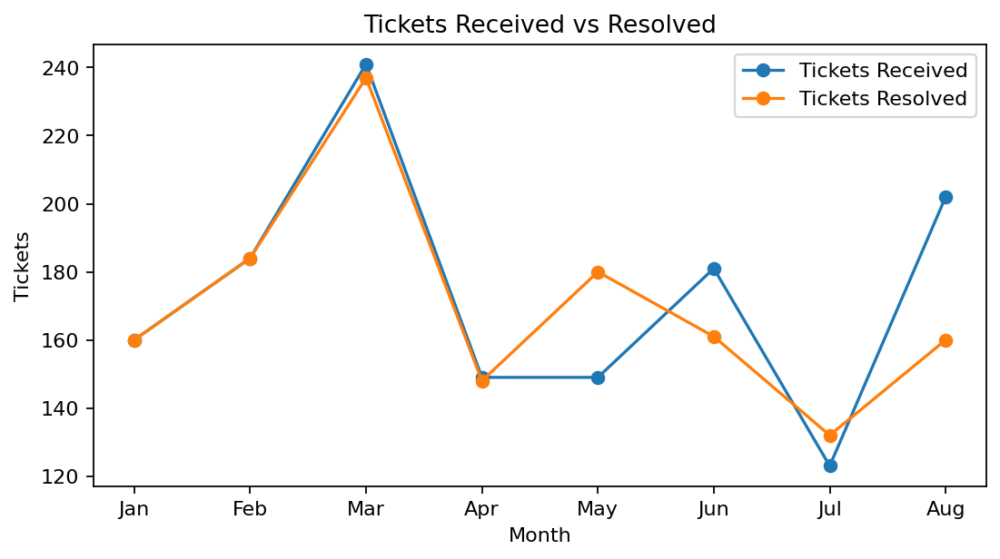
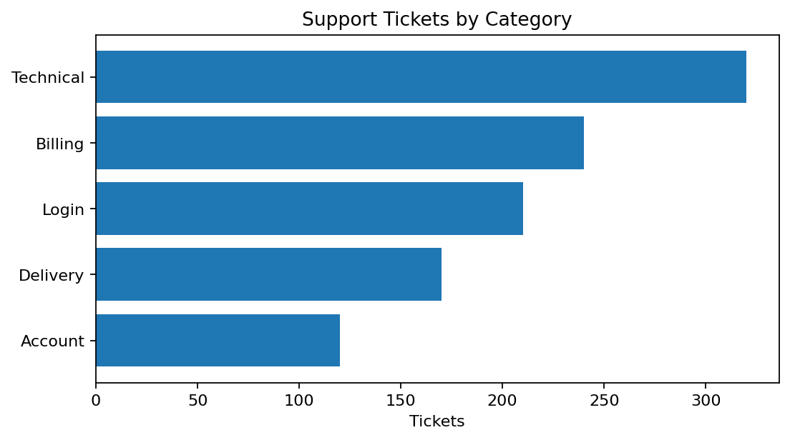
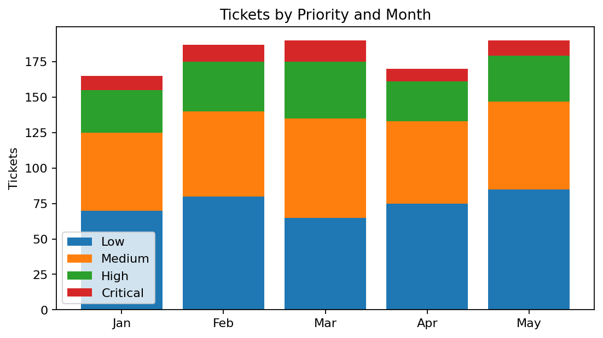
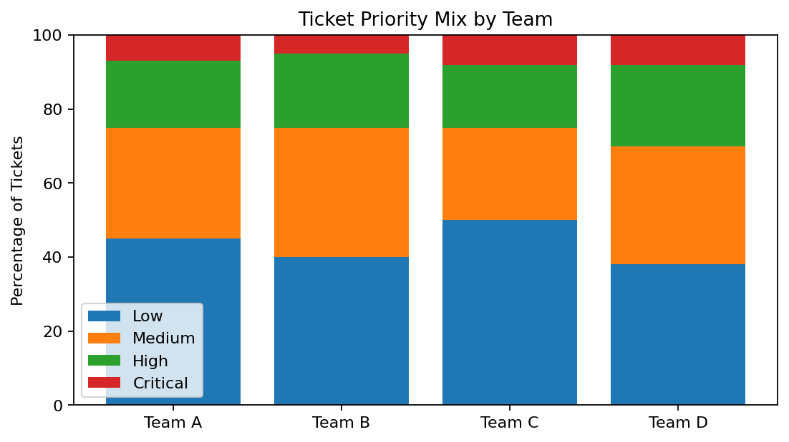
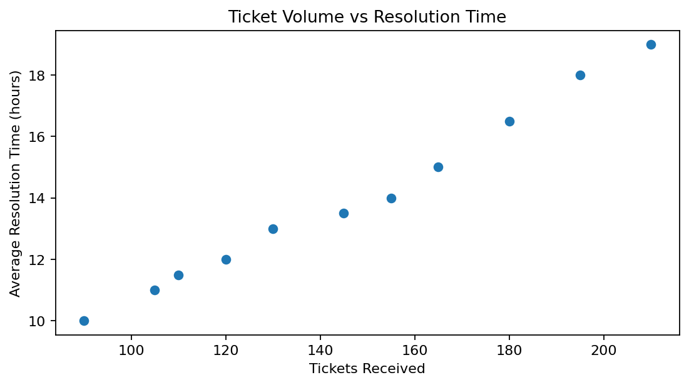
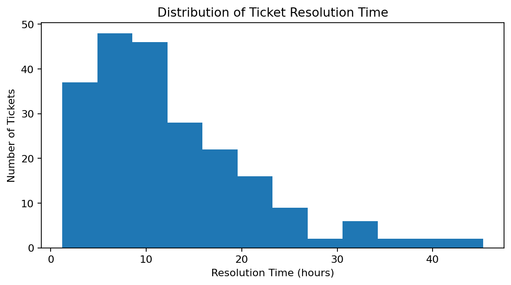
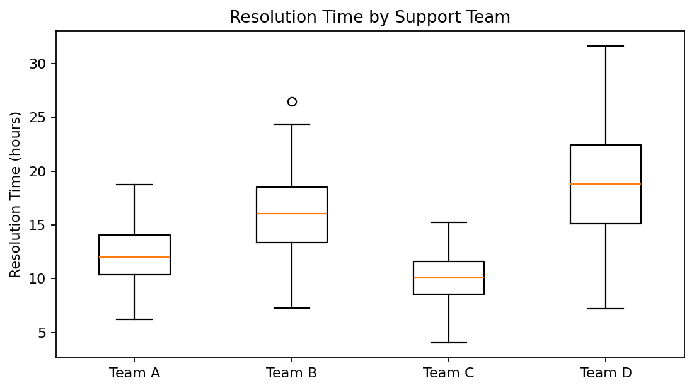
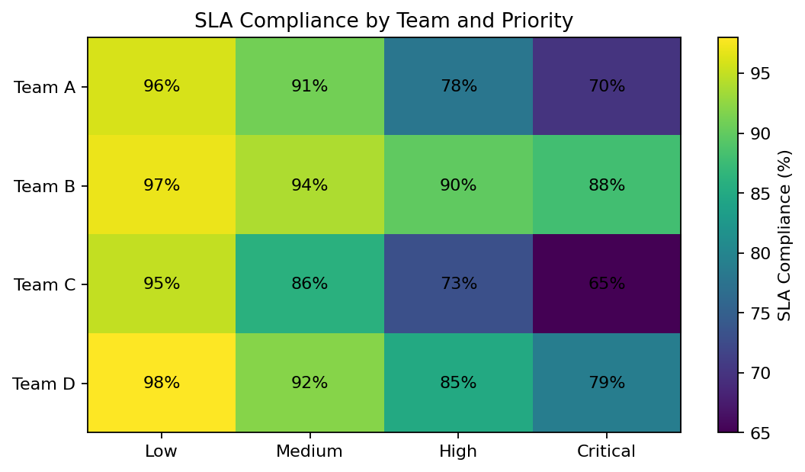
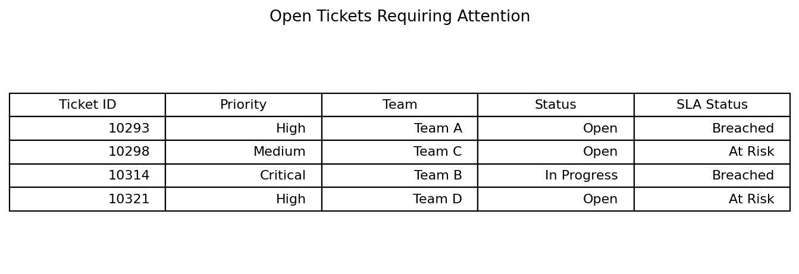

# Choosing Effective Visualisations and Telling the Story

In the previous section, we learned how to translate a business problem into:

- a business decision,
- analytical questions,
- data requirements,
- metrics and dimensions, and
- an analytical approach.

Once we know **what we are trying to understand**, we can decide how best to present the information.

This is where data visualisation comes in.

The key principle is:

> **Choose the visual based on the question you are trying to answer.**

Do not choose a chart simply because it looks interesting or because it is available in the visualisation tool.

---

# From Analytical Question to Visualisation

Consider the customer support example from the previous section.

Management wants to understand whether the support team is struggling to keep up with incoming demand.

We translated this into several analytical questions, such as:

- Is ticket volume increasing?
- Is backlog increasing?
- Which ticket categories generate the most demand?
- Which teams have longer resolution times?
- Are high-priority tickets meeting their SLA targets?

Each question may require a different way of presenting the data.

For example:

| Analytical Question | Common Visual |
|---|---|
| What is the current value? | KPI / Big Number |
| How has something changed over time? | Line Chart |
| Which category is highest or lowest? | Bar Chart |
| What contributes to a total? | Stacked Bar Chart |
| What proportion does each group contribute? | 100% Stacked Bar Chart |
| How is a numerical value distributed? | Histogram / Box Plot |
| Are two numerical variables related? | Scatter Plot |
| Where are high and low values across two dimensions? | Heatmap |
| Where is something happening geographically? | Map |
| Does the user need exact details? | Table |

These are guidelines rather than strict rules.

The best visual is the one that helps the audience understand the answer clearly.

---

# KPI or Big Number

A KPI is useful when the audience needs to see one important measure immediately.

Examples include:

- Revenue
- Profit
- Current Backlog
- Customer Satisfaction
- SLA Compliance

For example, management may ask:

> **How many unresolved support tickets do we currently have?**

A KPI can communicate the answer immediately.

In this example, the current backlog is shown together with a comparison against the previous month.

This is more useful than showing the number alone.

For example:

**Current Backlog: 438**

tells us the current value.

But:

**Current Backlog: 438  
+12% vs last month**

provides additional context.

It tells the stakeholder that the backlog has increased.

## When to Use a KPI

Use a KPI when:

- one number is particularly important,
- the audience needs a quick summary,
- performance can be compared against a target or previous period,
- the metric belongs at the top of an executive dashboard.

KPIs are often placed near the top of a dashboard because they provide a quick overview of the current situation.

---

# Line Chart

A line chart is useful for showing how something changes across an ordered sequence, particularly over time.

Examples include:

- monthly sales,
- daily website visits,
- weekly support tickets,
- quarterly customer satisfaction.

Use a line chart when the analytical question is:

> **How has something changed over time?**

For our customer support example, management may ask:

> **Is incoming ticket demand exceeding the number of tickets being resolved?**

The line chart makes it easier to compare the two measures across time.

We can look for:

- increases or decreases,
- peaks and troughs,
- changes in direction,
- unusual periods,
- gaps between different measures.

For example, if the number of tickets received begins to remain consistently above the number of tickets resolved, it may indicate that unresolved work is accumulating.

## When to Use a Line Chart

Use a line chart when:

- time or another ordered sequence is important,
- you want to identify a trend,
- you want to compare how several measures change over time.

Avoid using a line chart for unrelated categories because connecting the points suggests that there is a meaningful sequence between them.

---

# Bar Chart

Bar charts are useful for comparing different categories.

Examples include:

- revenue by product,
- tickets by category,
- profit by region,
- customers by segment.

Use a bar chart when the analytical question is:

> **Which category is higher or lower?**

For example:

> **Which ticket categories generate the most support demand?**

The length of each bar makes it easy to compare the categories.

In this example, the categories are sorted from highest to lowest.

Sorting is useful because it allows the stakeholder to identify the highest and lowest categories quickly.

## When to Use a Bar Chart

Use a bar chart when:

- comparing categories,
- ranking items,
- identifying the highest or lowest values,
- comparing a relatively small number of groups.

Horizontal bars are particularly useful when category names are long.

Whenever possible:

- sort categories meaningfully,
- start the numerical axis at zero,
- avoid unnecessary decoration,
- make labels easy to read.

---

# Stacked Bar Chart

A stacked bar chart shows both:

1. an overall total, and
2. how different groups contribute to that total.

For example, management may ask:

> **How many tickets are received each month, and what types of priority make up those tickets?**

Each bar represents the total number of tickets for a month.

The sections within each bar show how that total is divided across different priority levels.

This allows us to examine both:

- overall ticket volume, and
- the composition of that volume.

## When to Use a Stacked Bar Chart

Use a stacked bar chart when:

- the total is important,
- the composition of the total is also important,
- there are only a small number of categories.

Avoid using too many categories because the chart can quickly become difficult to read.

Also remember that comparing the middle sections of stacked bars can be difficult because they do not share the same starting point.

If precise comparison between categories is the main objective, separate bar charts may be clearer.

---

# 100% Stacked Bar Chart

A 100% stacked bar chart is similar to a stacked bar chart, but every bar represents **100%**.

Instead of comparing total volume, we compare the **proportion** of different groups.

For example:

> **Does the mix of ticket priorities differ across support teams?**

Each team's bar represents 100% of its tickets.

The sections show the percentage of tickets that are:

- Low,
- Medium,
- High,
- Critical.

This makes it easier to compare the composition between teams even if the teams handle different total numbers of tickets.

## Stacked vs 100% Stacked

Use a normal stacked bar when:

> **The total and its composition both matter.**

Use a 100% stacked bar when:

> **The percentage composition is more important than the total.**

---

# Scatter Plot

A scatter plot helps investigate the relationship between two numerical variables.

Examples include:

- advertising spend and sales,
- product price and quantity sold,
- ticket volume and resolution time,
- customer age and spending.

Use a scatter plot when the analytical question is:

> **Are two numerical variables related?**

For our support example:

> **When ticket volume increases, does average resolution time also increase?**

Each point represents an observation containing values for both variables.

We can look for patterns such as:

- both variables increasing together,
- one increasing while the other decreases,
- no obvious relationship,
- unusual observations.

In this example, higher ticket volume appears to be associated with longer resolution time.

However, this does not automatically prove that higher ticket volume **caused** the longer resolution time.

> **Correlation does not automatically mean causation.**

There may be other factors involved, such as:

- ticket complexity,
- staffing levels,
- priority mix,
- product issues.

The visualisation may therefore identify an area for further investigation rather than provide the final explanation.

---

# Histogram

A histogram shows the **distribution of a numerical variable**.

This is different from a bar chart.

A bar chart compares categories.

A histogram groups numerical values into ranges.

For example, management may ask:

> **How long do support tickets normally take to resolve?**

The horizontal axis represents ranges of resolution time.

The vertical axis shows how many tickets fall within each range.

A histogram helps us understand:

- where most values are concentrated,
- how much variation exists,
- whether the distribution is skewed,
- whether unusually high or low values exist.

## Why Distribution Matters

Suppose:

> **Average Resolution Time = 14 hours**

The average alone does not tell us whether:

- most tickets take around 14 hours,
- most tickets are resolved quickly but a few take extremely long,
- there are several different groups of tickets.

Looking at the distribution provides additional context.

---

# Box Plot

A box plot also helps us understand numerical distributions.

It is especially useful when we want to compare distributions across several groups.

For example:

> **Do different support teams have different ticket resolution times?**

A box plot summarises information such as:

- the median,
- the spread of the data,
- the range,
- unusual observations or outliers.

This makes it useful for comparing several groups without displaying every individual data point.

For example, two teams may have similar average resolution times but very different levels of variation.

A box plot can make this difference easier to identify.

---

# Heatmap

A heatmap uses colour intensity to help identify high and low values across two dimensions.

For example, management may ask:

> **Which combinations of support team and ticket priority have weaker SLA performance?**

In this example:

- rows represent support teams,
- columns represent ticket priorities,
- each cell represents SLA compliance.

The heatmap helps the audience quickly identify areas that may require attention.

For example, it may reveal that one team has lower SLA compliance for High and Critical priority tickets.

This may then become an area for further investigation.

## When to Use a Heatmap

Use a heatmap when:

- analysing two categorical dimensions together,
- looking for patterns across many combinations,
- highlighting high and low values.

Colour should communicate meaning.

Do not add colour simply for decoration.

---

# Maps

Maps are useful when **geographic location is important to the analytical question**.

Examples include:

- customers by country,
- incidents by region,
- sales by location,
- delivery delays by area.

A map may help answer:

> **Are problems concentrated in particular geographical areas?**

However, maps should not be used simply because the dataset contains a country, city or region field.

For example, if the question is:

> **Which region has the highest sales?**

a sorted bar chart may make the comparison easier.

But if the question is:

> **Are service problems concentrated geographically?**

a map may be more useful because location itself is part of the analysis.

## Choose Maps Only When Geography Matters

Ask yourself:

> **Would understanding the physical location help answer the business question?**

If the answer is no, another chart may communicate the information more clearly.

---

# Tables

Not everything needs to be displayed as a chart.

Tables are useful when users need to see **exact values or individual records**.

For example, an operational support manager may ask:

> **Which open tickets have already breached SLA?**

A table allows the manager to see information such as:

- Ticket ID,
- Priority,
- Support Team,
- Status,
- SLA Status.

This information can then be used to take operational action.

## Charts and Tables Have Different Purposes

A useful general rule is:

> **Use charts to understand patterns.**

> **Use tables to look up details.**

A dashboard can contain both.

For example:

- a chart may show that SLA breaches are increasing,
- a detailed table may show exactly which tickets have breached SLA.

---

# Choosing Between Similar Visualisations

Sometimes several chart types could answer the same question.

The analyst must decide which visual makes the important comparison easiest to understand.

Ask:

1. What question are we trying to answer?
2. What should the audience notice?
3. Which comparison is most important?
4. How quickly can the audience understand the visual?
5. Is there unnecessary complexity?

The most complicated visual is not necessarily the most effective.

Often, simple charts communicate the message more clearly.

---

# Avoid Unnecessary Complexity

A visualisation should make information **easier**, not harder, to understand.

Avoid unnecessary elements such as:

- 3D effects,
- excessive colours,
- too many chart types,
- heavy gridlines,
- decorative backgrounds,
- unnecessary icons,
- too many labels,
- unnecessary decimal places.

Every visual element should have a purpose.

Ask:

> **Does this element help the audience understand the data?**

If the answer is no, consider removing it.

---

# Use Colour With Purpose

Colour is one of the strongest ways to direct attention in a visualisation.

Use it deliberately.

## Highlighting

Colour can draw attention to an important value or problem area.

For example, one category with unusually poor performance could be highlighted while the remaining categories use a more neutral appearance.

## Grouping

The same colour can indicate that items belong to the same group.

For example, the same product category should generally use the same colour across a dashboard.

## Status

Colour may also communicate status, such as:

- good performance,
- warning,
- poor performance.

However, do not rely entirely on colour.

Labels and text should also help users understand the information.

---

# Use Meaningful Titles

Chart titles are part of the story.

Consider:

> **Support Tickets by Month**

This describes what the chart contains.

It is a **descriptive title**.

Now consider:

> **Support demand exceeded resolution capacity from June to October**

This tells the audience what they should notice.

It is an **insight-driven title**.

---

# Descriptive Titles vs Insight-Driven Titles

| Descriptive Title | Insight-Driven Title |
|---|---|
| Sales by Region | West drives revenue growth but has the lowest margin |
| Tickets by Month | Ticket demand peaked sharply in August |
| Customer Churn by Segment | New customers have the highest churn rate |
| SLA Compliance by Category | Technical issues account for most SLA breaches |

During exploratory analysis, descriptive titles are often appropriate because we may not yet know what the data will reveal.

Once the analysis is complete and we are communicating the findings, insight-driven titles can make the message much clearer.

---

# From Visualisation to Data Storytelling

One chart may answer one analytical question.

However, business problems usually require several questions to be answered together.

This is where **data storytelling** becomes important.

A dashboard should not feel like a random collection of charts.

The visuals should work together to help the audience understand the business problem.

A useful storytelling flow is:

**Context  
→ What Happened?  
→ Where or Why?  
→ Why Does It Matter?  
→ What Should We Do?**

---

# 1. Context

Remind the audience why the analysis was performed.

For example:

> Customer support management is concerned that the team may not be keeping up with incoming demand.

This gives the dashboard a clear purpose.

---

# 2. What Happened?

Begin with the overall situation.

For example:

> Ticket backlog has increased.

This may be communicated using:

- KPIs,
- overall trends,
- high-level measures.

---

# 3. Where or Why?

Break down the overall result to understand where the problem is occurring.

For example:

> Most of the increase in SLA breaches comes from Technical and Login-related tickets.

This may require comparing:

- categories,
- products,
- teams,
- customer segments,
- regions.

---

# 4. Why Does It Matter?

Explain the business impact.

For example:

> Increasing backlog may result in longer customer waiting times and lower customer satisfaction.

This connects the analytical finding back to the original business problem.

---

# 5. What Should We Do?

The final step is to connect the findings to an action.

For example:

> Investigate the underlying technical issues before deciding whether permanent additional staffing is required.

The recommendation should be supported by the evidence.

---

# Designing an Executive Dashboard

A useful executive dashboard often follows a top-to-bottom sequence.

## 1. What is happening?

Show the most important KPIs.

For example:

- Tickets Received
- Tickets Resolved
- Current Backlog
- SLA Compliance

↓

## 2. How is it changing?

Show the trend over time.

For example:

> Tickets Received vs Tickets Resolved

↓

## 3. Where is the problem?

Break the result down.

For example:

> SLA Breaches by Ticket Category

↓

## 4. What may be driving it?

Investigate the problem further.

For example:

> Resolution Time by Support Team

↓

## 5. What requires action?

Summarise:

- the key insight,
- the business impact,
- the recommended next action.

This creates a logical story rather than a collection of unrelated charts.

---

# Example: Customer Support Dashboard

Suppose the original business question is:

> **Does the organisation need additional customer support resources?**

The dashboard might contain:

## Overall Performance

- Tickets Received
- Tickets Resolved
- Current Backlog
- SLA Compliance

## Trend

Tickets Received vs Tickets Resolved over time

## Problem Areas

SLA Breaches by Ticket Category

## Operational Comparison

Average Resolution Time by Support Team

## Priority

SLA Compliance by Priority

## Key Insight

A short statement explaining the most important finding.

## Recommended Action

A short evidence-based recommendation explaining what should happen next.

Each visual answers a different analytical question.

Together, they help answer the larger business question.

---

# Activity: Choose the Right Visual

For each question below, identify an appropriate visualisation.

## Question 1

> How has monthly revenue changed over the past two years?

**Suggested answer: Line Chart**

Why?

Because the question is about change over time.

---

## Question 2

> Which five products generate the highest profit?

**Suggested answer: Bar Chart**

Why?

Because the objective is to compare and rank categories.

---

## Question 3

> What is our current customer satisfaction score?

**Suggested answer: KPI**

Why?

Because the stakeholder needs to see one important current value.

---

## Question 4

> Is advertising spend associated with higher sales?

**Suggested answer: Scatter Plot**

Why?

Because we are investigating the relationship between two numerical variables.

---

## Question 5

> How are customer waiting times distributed?

**Suggested answer: Histogram or Box Plot**

Why?

Because we want to understand the distribution rather than only the average.

---

## Question 6

> Which combinations of support team and ticket priority have the lowest SLA compliance?

**Suggested answer: Heatmap**

Why?

Because we are comparing a metric across two categorical dimensions.

---

## Question 7

> Which open tickets have already breached SLA?

**Suggested answer: Table**

Why?

Because the user needs exact ticket-level details.

---

# Visualisation Checklist

Before presenting a visualisation, ask:

## Purpose

- Does this visual answer a clear analytical question?
- Does the visual support the original business problem?

## Chart Selection

- Is the chart type appropriate for the question?
- Would another visual make the comparison easier?

## Clarity

- Can the audience understand the visual quickly?
- Is unnecessary information removed?
- Are labels easy to understand?

## Communication

- Does the title communicate the purpose or insight?
- Is colour being used intentionally?
- Is enough context provided?

## Decision Making

- What should the stakeholder learn from this visual?
- Why does the finding matter?
- Does it help support a decision or action?

---

# Key Takeaways

Choosing an effective visualisation follows this process:

**Analytical Question  
→ Appropriate Visual  
→ Insight  
→ Story  
→ Decision**

Do not begin with:

> **"Which chart do I want to create?"**

Instead, ask:

> **"What does my audience need to understand?"**

Different visualisations help answer different types of questions.

The role of the analyst is to choose the visual that makes the answer as clear as possible.

In the next section, we will consider how to choose an appropriate tool for creating and delivering these visualisations.
