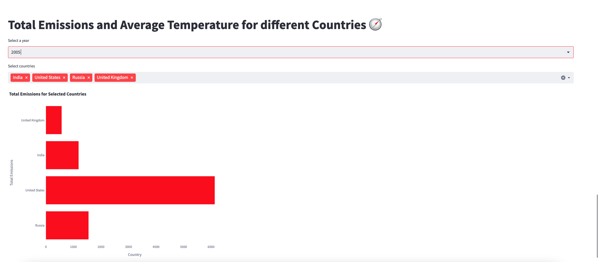

# Exercise 1

## Exercise: Total Emissions and Average Temperature for Different Countries

In this exercise, we will create visualizations using Streamlit to analyze the total emissions and average temperature for different countries in a specific year. We will display this information using a bar chart for selected countries.

### Problem Description:
You have been provided with a dataset that contains information about carbon emissions and average temperature for different countries over several years. Your task is to create visualizations that showcase the total emissions for selected countries in a specific year. Additionally, you will create a bar chart to compare the total emissions of these countries.

### Instructions:
Follow the steps below to complete the exercise:

1. Start by adding a title to your Streamlit app using `st.title()` and set it to "Total Emissions and Average Temperature for different Countries 🧭".

2. Create a variable named `year_options` and set it to the unique values in the 'YEAR' column of the `emission_temperature` DataFrame using the `.unique()` method.

3. Use the `st.selectbox()` function to create a dropdown menu for selecting a year. Pass the `year_options` variable as the options and store the selected year in a variable named `selected_year`.

4. Create a variable named `selected_countries` using `st.multiselect()` to allow the user to select multiple countries from a list. Use the 'COUNTRY' column of the `emission_temperature` DataFrame as the options. Provide a unique key, such as 'country A', to the `st.multiselect()` function.

5. Filter the `emission_temperature` DataFrame to include only the rows where the 'COUNTRY' column matches any of the selected countries and the 'YEAR' column matches the `selected_year`. Store the filtered data in a new DataFrame named `filtered_data_bar`.

6. Implement the `display_bar_chart()` function. This function will use Plotly Express to create a horizontal bar chart. Pass the `filtered_data_bar` DataFrame along with the appropriate column names and titles to the function. Adjust the width and height of the chart to ensure proper display. You can also customize the color of the bars by providing a color code.

7. Run your Streamlit app and test the functionality. Select different years and countries, and observe how the total emissions are displayed in the bar chart.

**Note**: Make sure you have imported the necessary libraries, established a connection to the database, and retrieved the `emission_temperature` DataFrame before implementing the above steps.

