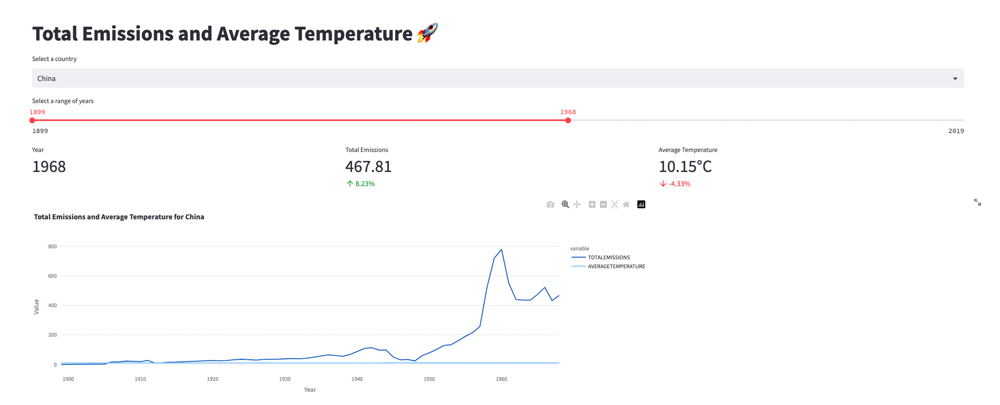

# Exercise 2

## Exercise: Total Emissions and Average Temperature

In this exercise, we will create visualizations using Streamlit to analyze the total emissions and average temperature for a specific country over a selected range of years. We will display key metrics such as total emissions, average temperature, and their percentage changes. Additionally, we will create a line plot to visualize the trends in emissions and temperature over time.

### Problem Description:
You have been provided with a dataset that contains information about carbon emissions and average temperature for different countries over several years. Your task is to create visualizations that showcase the total emissions and average temperature for a selected country over a specific range of years. Additionally, you will display the percentage change in emissions and temperature compared to the previous year.

### Instructions:
Follow the steps below to complete the exercise:

1. Start by adding a title to your Streamlit app using `st.title()` and set it to "Total Emissions and Average Temperature 🚀".

2. Define the name of the table that contains the emission and temperature data. Use the variable `emission_temp` and set it to the appropriate table name, such as "EXERCISE_CO2_VS_TEMPERATURE.CARBON_EMISSIONS.AGGREGATE_COUNTRY_EMISSIONS_TEMPERATURES".

3. Write a query to retrieve the necessary data from the specified table. The query should select the country, year, per capita emissions, share of global emissions, total emissions, and average temperature. Store the retrieved data in a variable named `emission_temperature`.

4. Create a pandas DataFrame named `filtered_data` to store the emission and temperature data for the selected country. Use the `st.selectbox()` function to allow the user to select a country from the available options. Filter the `emission_temperature` DataFrame based on the selected country and store the filtered data in `filtered_data`.

5. Implement a slider using `st.slider()` to allow the user to select a range of years. Set the minimum and maximum values to the minimum and maximum years available in the `filtered_data` DataFrame. Set the default value to the minimum and maximum years. Store the selected year range in a variable named `year_range`.

6. Retrieve the data for the selected year from the `filtered_data` DataFrame. Create a new DataFrame named `selected_year_data` that contains only the rows where the 'YEAR' column matches the maximum year in the `year_range`. Extract the values for the average temperature and total emissions from this DataFrame and store them in the variables `average_temperature` and `total_emissions`, respectively.

7. Retrieve the data for the previous year from the `filtered_data` DataFrame. Create a new DataFrame named `previous_year_data` that contains only the rows where the 'YEAR' column matches the maximum year minus 1. Extract the value for total emissions and average temperature from this DataFrame and store them in the variables `previous_year_emissions` and `previous_year_temperature`, respectively.

8. Calculate the percentage change in emissions and temperature compared to the previous year. Store the calculated values in the variables `percentage_change_emission` and `percentage_change_temperature`, respectively.

9. Implement the `display_line_plot()` function. This function will use Plotly Express to create a line plot. Pass the `filtered_data` DataFrame along with the appropriate column names and titles to the function. Adjust the width of the plot to ensure proper display.

10. Use the `col1.metric()`, `col2.metric()`, and `col3.metric()` functions to display the key metrics: year, total emissions, average temperature, and their respective percentage changes. Adjust the formatting and labels to provide clear information.

11. Run your Streamlit app and test the functionality. Select different countries, year ranges, and observe how the metrics

