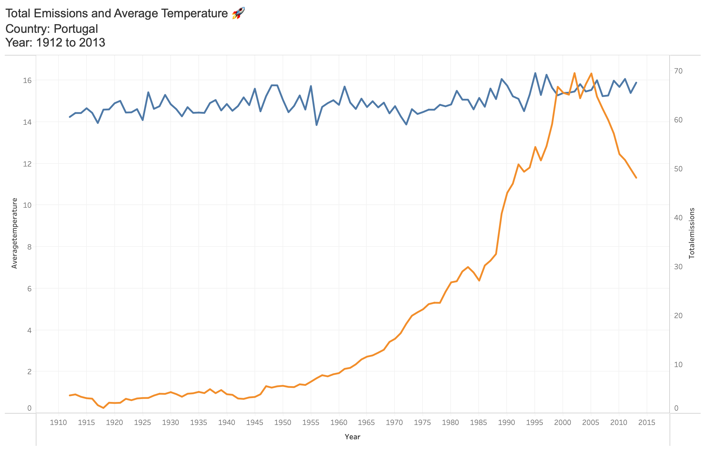

# Exercise 2

## Exercise: Total Emissions and Average Temperature

In this exercise, we will create visualizations using Streamlit to analyze the total emissions and average temperature for a specific country over a selected range of years. We will display key metrics such as total emissions, average temperature, and their percentage changes. Additionally, we will create a line plot to visualize the trends in emissions and temperature over time.

### Problem Description:
You have been provided with a dataset that contains information about carbon emissions and average temperature for different countries over several years. Your task is to create visualizations that showcase the total emissions and average temperature for a selected country over a specific range of years. Additionally, you will display the percentage change in emissions and temperature compared to the previous year.


### Instructions:
Follow the steps below to complete the exercise:

1. Import the csv data generated from the previous exercise into Tableau public.

2. Go to the "Sheet 1" tab in Tableau Public and rename it to "Total Emissions and Average Temperature for different Countries 🧭", Select the option as Line under the "Mark" - "All" Section

3. Ensure that the "YEAR" and "COUNTRY" columns are set as dimensions in Tableau, Also ensure Year is set as Whole Number by right clicking on the Year column.

4. Drag the Total Emissions and Average Temperature columns to the Rows shelf and Drag the Year to the Columns shelf.

5. Drag the "COUNTRY" dimension to the Filter shelf and select show filter option.  

6. Similarly, drag the "YEAR" dimension to the Filter shelf and select show filter option, the filter should be showing range of values instead of list of values, because here the year is whole number.

7. Select the Total Emissions dual axis by right clicking, to merge the two charts to be displayed on the same axis.

7. In the title make the Year and Country dynamic by below syntax:
   ```
    Country: <Country>
    Year: <Year>
   ```

8. The final chart should look something like below:

