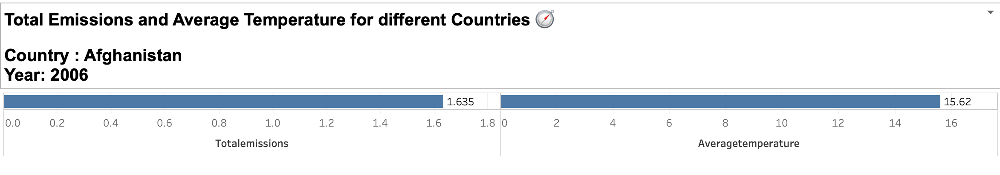
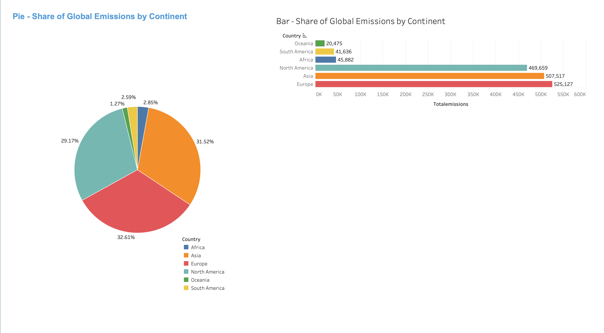

# Exercise 3

## Exercise: Share of Global Emissions by Continent

Till now, we have creating charts in Tableau Sheets, But in real world we will have requirement to create dashboards which can have multiple charts and filters. In this exercise we will create a simple dashboard that will have two charts.

In this exercise, we will create visualizations using Tableau to analyze the share of global emissions by continent. We will display the data in both bar chart and pie chart formats, allowing for easy comparison and understanding.

### Problem Description:
You have been provided with a dataset that contains information about the share of global emissions by continent. Your task is to create visualizations that showcase the distribution of emissions among different continents. Specifically, you will create a bar chart to compare the emission shares of each continent and a pie chart to display the share of emissions by country for a selected year.

### Instructions:
Follow the steps below to complete the exercise:

1. Import the csv data generated from the previous exercise into Tableau public.

2. Go to the "Sheet 1" tab in Tableau Public and rename it to "Total Emissions and Average Temperature for different Countries 🧭".Select the option as Bar under the "Mark" - "All" Section

3. Ensure that the "YEAR" and "COUNTRY" columns are set as dimensions in Tableau, Also ensure Year is set as Date by right clicking on the Year column.

4. Drag the Total Emissions and Average Temperature columns to the Rows shelf.
Note: you can also use it in columns shelf if you want vertical bar chart.

5. Drag the "COUNTRY" dimension to the Filter shelf and select show filter option.  

6. Similarly, drag the "YEAR" dimension to the Filter shelf and select show filter option.

7. In the title make the Year and Country dynamic by below syntax:
   ```
    Country : <Country>
    Year: <YEAR(Year)>
   ```

8. The final chart should look something like below:




air99306