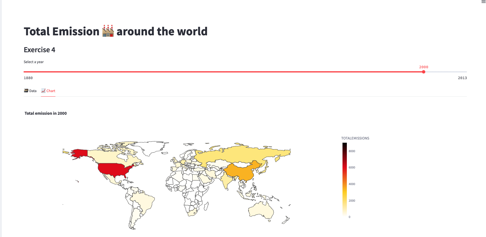

# Exercise 4

## Exercise: Worldwide Total CO2 Emission 🏭 Choropleth Map

In this exercise, we will create a choropleth map using Streamlit to visualize the total CO2 emissions across different countries for each selected year. The map will provide a visual representation of the emission levels worldwide.

### Problem Description:
You have been given a dataset containing information about CO2 emissions for various countries over multiple years. Your task is to create a choropleth map that displays the total CO2 emissions for each country on a world map, with the ability to select the year using a slider.

### Instructions:
Follow the steps below to complete the exercise:

1. Begin by adding a subheader in your Streamlit app with the text "Total Emission 🏭 around the world".

2. Define the name of the table that contains the CO2 emission data. You can use the variable `emission_table` and set it to the appropriate table name, such as "EXERCISE_CO2_VS_TEMPERATURE.CARBON_EMISSIONS.CO2_EMISSIONS_AND_TEMPERATURES_BY_COUNTRY".

3. Retrieve the emission data for the selected year from the specified table. Use a query to filter the data based on the chosen year. You can use the variable `year_to_plot` to represent the selected year. Store the retrieved data in a variable named `emission`.

4. Create a pandas DataFrame named `em` to store the emission data. Specify the column names as 'year', 'TOTALEMISSIONS', and 'Country' to match the columns returned by the query.

5. Use Streamlit tabs to display the data and the choropleth chart side by side. Create two tabs with the labels "🗃 Data" and "📈 Chart" to organize the content.

6. Within the "🗃 Data" tab, display the DataFrame `em` using the `display_data_frame` function.

7. Within the "📈 Chart" tab, call the `display_choropleth_map` function and pass the DataFrame `em` along with the necessary parameters: "Country" as the locations column, "TOTALEMISSIONS" as the color column, the desired color range, color scale, and a title indicating the selected year.

8. Implement the `display_choropleth_map` function. This function will use the Plotly Express library to create a choropleth map based on the provided DataFrame. Set the locations column, location mode, color column, color range, color scale, and title. Adjust the layout settings, such as the height and width of the figure, to ensure proper display.

9. Run your Streamlit app and test the choropleth map functionality. Use the slider to select different years and observe how the map updates with the corresponding total CO2 emissions for each country.

10. Verify that the data and chart are displayed correctly in the respective tabs.

11. Make any necessary adjustments to the code or styling to enhance the user experience and improve the visualization as needed.

12. Once you are satisfied with your Streamlit app and the choropleth map functionality, you have successfully completed the exercise.

Remember to refer to the provided code snippets and adapt them to your Streamlit app. Feel free to customize the styling, labels, and any additional features to make the visualization more informative and visually appealing.

