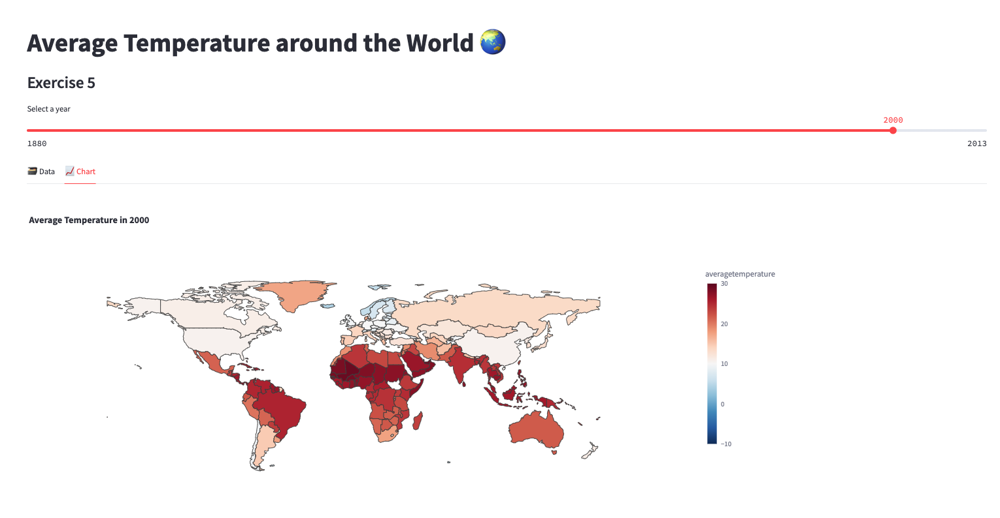

# Exercise 5

## Exercise: Worldwide Average Temperature Choropleth Map 🌏

In this exercise, we will create a choropleth map using Streamlit to visualize the average temperature across different countries for each selected year. The map will provide a visual representation of the temperature variations worldwide.

To complete this exercise, follow the instructions below:

1. Add a subheader to your Streamlit app: "Average Temperature around the World 🌏".

2. Define the name of the table containing the required data. For this exercise, we will use the table named "EXERCISE_CO2_VS_TEMPERATURE.GLOBAL_TEMPERATURES.AGGREGATE_COUNTRY_TEMPERATURES".

3. Retrieve the data for the selected year using a query. Use the `year_to_plot` variable to dynamically select the year. The query should be structured as follows:
   ```
   SELECT * FROM table_name WHERE year = year_to_plot
   ```

4. Create a Pandas DataFrame from the retrieved data. Specify the column names as 'year', 'averagetemperature', and 'Country'.

5. Create two tabs in your Streamlit app: "🗃 Data" and "📈 Chart". Use the `st.tabs` function to achieve this.

6. Within the "🗃 Data" tab, display the Pandas DataFrame using the `st.dataframe` function.

7. Within the "📈 Chart" tab, create a function called `display_choropleth_map` that takes the DataFrame, locations column, color column, color range, color scale, and title as input parameters. This function will generate and display the choropleth map.

8. Inside the `display_choropleth_map` function, use the `px.choropleth` function from the Plotly library to create the choropleth map. Set the `locations` parameter to the locations column, specify the `locationmode` as "country names", set the `color` parameter to the color column, and define the `range_color`, `color_continuous_scale`, and `title` based on the input parameters.

9. Customize the layout of the choropleth map using the `update_layout` function. Set the `geo` parameter to control the appearance of the map, such as showing or hiding frames and coastlines. Adjust the `height` and `width` parameters to set the size of the figure.

10. Update the traces of the choropleth map using the `update_traces` function, setting the `locations` parameter to the locations column of the DataFrame.

11. Use the `st.plotly_chart` function to render and display the choropleth map in the "📈 Chart" tab of your Streamlit app.

By following these instructions, you will create a Streamlit app that allows users to explore and visualize the average temperature across different countries on a choropleth map.

