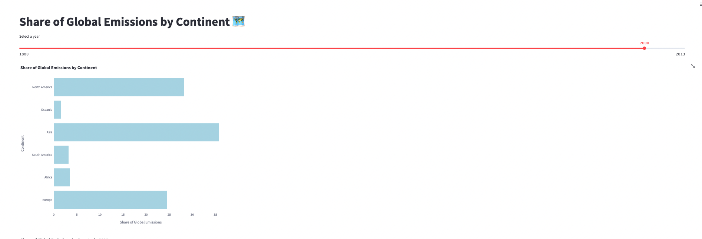
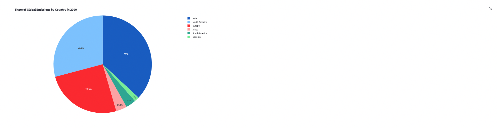

# Exercise 3

## Exercise: Share of Global Emissions by Continent

In this exercise, we will create visualizations using Streamlit to analyze the share of global emissions by continent. We will display the data in both bar chart and pie chart formats, allowing for easy comparison and understanding.

### Problem Description:
You have been provided with a dataset that contains information about the share of global emissions by continent. Your task is to create visualizations that showcase the distribution of emissions among different continents. Specifically, you will create a bar chart to compare the emission shares of each continent and a pie chart to display the share of emissions by country for a selected year.

### Instructions:
Follow the steps below to complete the exercise:

1. Start by adding a title to your Streamlit app using `st.title()` and set it to "Share of Global Emissions by Continent 🗺".

2. Define the name of the table that contains the emission and temperature data. Use the variable `emission_temp_continent` and set it to the appropriate table name, such as "EXERCISE_CO2_VS_TEMPERATURE.CARBON_EMISSIONS.AGGREGATE_COUNTRY_EMISSIONS_TEMPERATURES".

3. Write a query to retrieve the necessary data from the specified table. The query should select the country, share of global emissions, and year columns for the continents: Europe, Asia, Africa, North America, South America, and Oceania. Store the retrieved data in a variable named `emission_data`.

4. Create a pandas DataFrame named `df_emission` to store the emission data. Specify the column names as 'COUNTRY', 'SHAREOFGLOBALEMISSIONS', and 'YEAR' to match the columns returned by the query.

5. Add a slider to your Streamlit app using `st.slider()` to allow the user to select a year. Set the minimum value to 1800, the maximum value to 2013, and the default value to 2000. Store the selected year in a variable named `year_to_plot`.

6. Filter the DataFrame `df_emission` based on the selected year. Create a new DataFrame named `df_filtered` that contains only the rows where the 'YEAR' column matches the selected year.

7. Implement the `display_bar_chart()` function. This function will use Plotly Express to create a horizontal bar chart. Pass the `df_filtered` DataFrame along with the appropriate column names and titles to the function. Adjust the width and height of the chart to ensure proper display.

8. Implement the `display_pie_chart()` function. This function will use Plotly Express to create a pie chart. Pass the `df_filtered` DataFrame along with the necessary column names, labels, and titles to the function. Adjust the width and height of the chart to ensure proper display.

9. Run your Streamlit app and test the functionality. Use the slider to select different years and observe how the bar chart and pie chart update accordingly, reflecting the share of global emissions by continent and country for the selected year.

10. Verify that the bar chart and pie chart are displayed correctly with the appropriate labels, titles, and data.

11. Make any necessary adjustments to the code or styling to enhance the user experience and improve the visualizations as needed.

12. Once you are satisfied with your Streamlit app and the visualizations, you have successfully completed the exercise.

Refer to the provided code snippets and customize them as necessary to integrate them into your Streamlit app. Feel free to modify the colors, labels, and chart settings to make the visualizations more visually appealing and informative.

